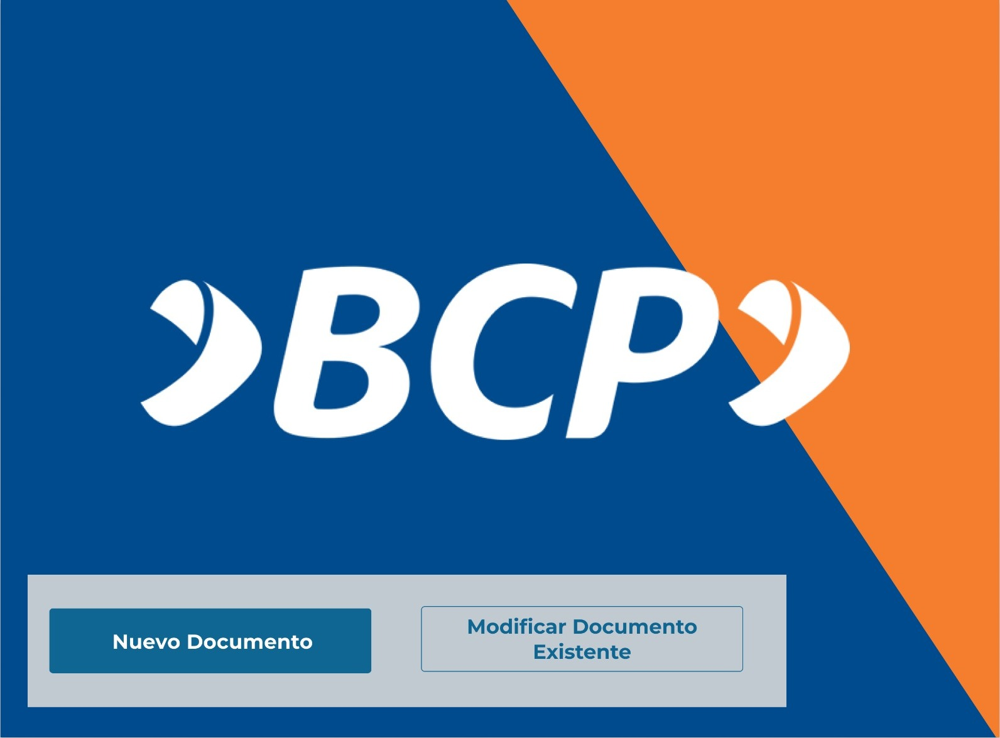

# Prototipo

## -

## Creación o modificación del Documento de Alcance

* El Data Steward una vez que se haya registrado, aparecerá una página en la cual mostrará dos opciones: “Crear Nuevo Documento de Alcance” y “Modificar nuevo Documento de Alcance”. Se deberá escoger una de las dos opciones.

 

* Luego de haber escogido, saldrá una ventana emergente para detallar la versión del documento. Los campos que tendrá serán para especificar qué cambios se van a realizar y por quién fueron solicitados esos cambios.

 

---

[Regresar al Entregable 3](../entregable3.md)

[Regresar al índice](../../README.md)