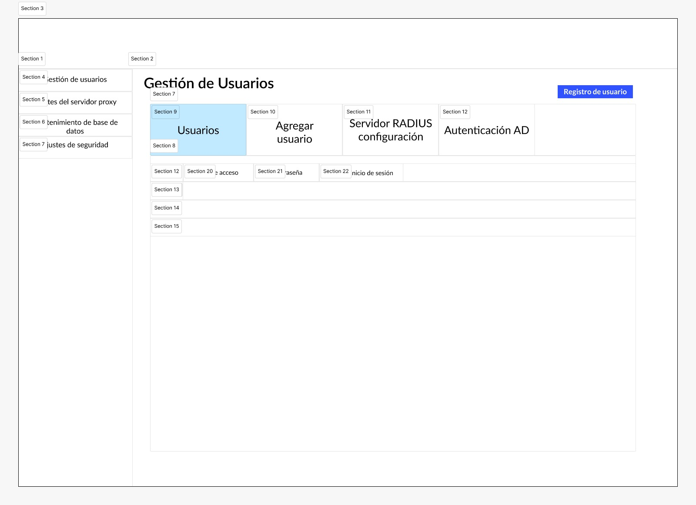
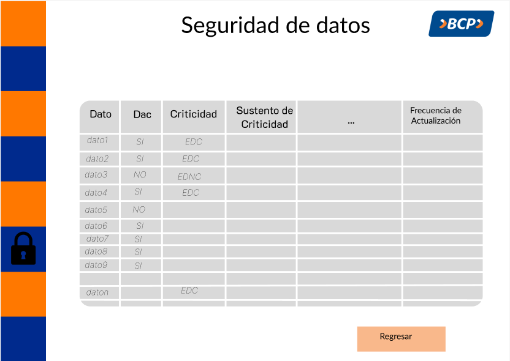

# Prototipo

## Seguridad de Gestión de usuarios

* El administrador del sistema se encargará de registrar a los usuarios ingresando su nombre, correo electrónico y rol en el sistema.
Una vez registrado, le proporcionará las credenciales de inicio de sesión a los respectivos usuarios.
Además, se encargará de tomar las configuraciones de seguridad y prevención de ataques correspondientes como la configuración de un servidor proxy o verificación de usuarios.

 

* El usuario inicia sesión con las credenciales proporcionadas por el adminsitrador del sistema.

 

## Creación o modificación del Documento de Alcance

* El Data Steward una vez que se haya registrado, aparecerá una página en la cual mostrará dos opciones: “Crear Nuevo Documento de Alcance” y “Modificar nuevo Documento de Alcance”. Se deberá escoger una de las dos opciones.

 

* Luego de haber escogido, saldrá una ventana emergente para detallar la versión del documento. Los campos que tendrá serán para especificar qué cambios se van a realizar y por quién fueron solicitados esos cambios.

 

## Ingresar información del documento de alcance y búsqueda de equivalencias

* Después de darle click a "Aceptar", se mostrará una ventana incial dónde se verá el progreso de llenado del documento de alcance por cada sección, con opciones de abrir cada una de ellas mediante un botón de enlace.

 

* Al darle click al botón de enlace relacionado con la información general, se abrirá una pestaña dónde se podrá rellenar cada campo eligiendo una de las opciones de cada lista desplegable. Terminado el llenado se dará click a "siguiente".

 

* Se abrirá la ventana de la sección de información de referencia, dónde al igual que la ventana anterior se podrá elegir entre opciones de la lista desplegable para ciertos campos, pero adicionalmente, para los campos restantes que lo requieren, se podrá insertar texto. Por último, se dará click a "Siguiente", o en caso se quiera modificar datos de la venta anterior se dará click a "Regresar".

 

* En caso se haya seleccionado "Siguiente", se abrirá la ventana de la sección de conceptos de negocio, dónde se podrá rellenar los campos, seleccionando opciones o insertando texto. Y una función adicional, es que se podrá seleccionar de un calendario la fecha para el campo de "Fecha Historia". Por ultimo, seleccionamos "Guardar" o "Regresar" según se requiera.

 

* Al darle click a "Guardar", nos redireccionará a la ventana inicial de progreso y el siguiente usuario responsable tendrá la opción de ver la tabla de equivalencias que se ha generado, en base a las datos de la seccion de información de referencia o ingresar directamente a la sección de información del modelo.

* En caso se seleccione la primera opción, se abrirá la ventana siguiente, con las equivalencias por cada dato.

 

* Por otro lado, en la segunda opción se abrirá la ventana de la sección de información del modelo, dónde se podrá rellenar los campos en base a las equivalencias encontradas, y se podrán ayudar del botón "regresar a la tabla" para verlas. Asimismo, se tendrán otros campos dónde se podrán seleccionar opciones de las listas desplegables correspondientes. Por último, se le da click a "Finalizar y guardar" para almacenar la información en su totalidad.

 

## Seguridad de datos
* En esta sección, el usuario selecciona el Documento de interfaz relacionado con el porceso de migración actual, para que se pueda dar la clasificación de los datos ingresados. En este documento estarán las especificaciones brindadas por los usuarios de origen respecto a cada dato, detallando si son datos sensibles, su criticidad, el sustento de criticidad, etc.
El sistema internamente hará este proceso mientras se muestra la tabla de progreso y finalmente la opción de ver estos datos ya clasificados, para comprobarlo por última vez.

 

 

* En la parte de Información Adicional, consta de dos secciones: Información del moldelo y Definiciones técnicas. En la primera parte se tiene que ingresar el Nombre de la tabla, el código de proceso, nombre del job y la ruta de la tabla. La parte del Código del proceso será generado por el sistema ya que solo consta de la concatenación de [Nombre de la tabla]+[Código del proceso], según los lineamientos de calidad. 
 Igualmente con la sección de Definiciones técnicas.
 

 

 
---

[Regresar al Entregable 3](../entregable3.md)

[Regresar al índice](../../README.md)
