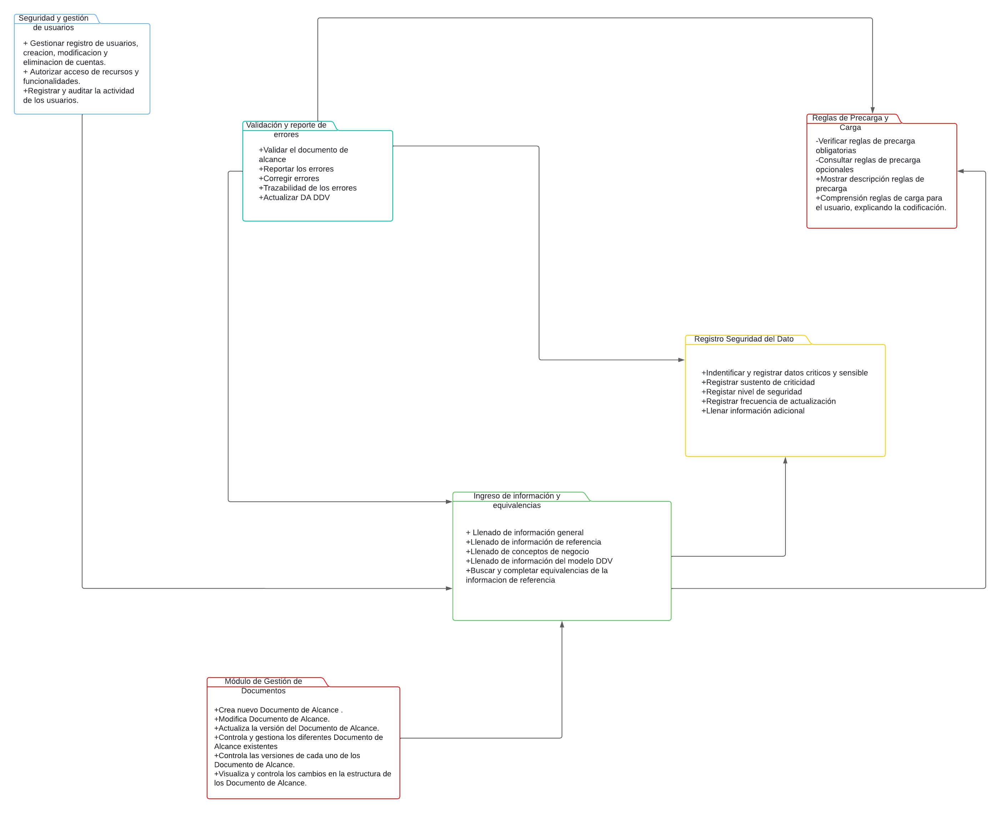

# Módulos

## Módulo de Seguridad

El módulo de seguridad se encarga de administrar la autenticación, autorización y control de acceso de los usuarios al sistema, garantizando la integridad y confidencialidad de los datos.

#### Interacción con otros módulos: 
Este módulo se integra estrechamente con todos los demás módulos del sistema para garantizar que el acceso a las funcionalidades y datos esté protegido según los roles y permisos definidos, además implementa medidas para prevenir y mitigar posibles ataques cibernéticos, protegiendo así la integridad y confidencialidad de los datos del sistema.

#### Responsabilidades
* Gestionar el registro de usuarios, incluyendo la creación, modificación y eliminación de cuentas.
* Implementar la autenticación de doble factor para añadir una capa adicional de seguridad al proceso de inicio de sesión.
* Autorizar el acceso a recursos y funcionalidades según los roles y permisos asignados
* Controlar el acceso a áreas sensibles del sistema y proteger contra intentos de intrusión.
* Registrar y auditar la actividad de los usuarios para detectar posibles amenazas o violaciones de seguridad.
* Gestionar la sesión de usuario, incluyendo la gestión de tokens de autenticación y la expiración de sesiones.
* Mantener actualizadas las políticas de seguridad y protocolos de autenticación para adaptarse a las necesidades cambiantes del sistema y las regulaciones de seguridad.
* Implementar firewalls y filtros de paquetes para controlar el tráfico de red y evitar intrusiones no autorizadas.
* Mantener el software y los sistemas del sistema actualizados con los últimos parches de seguridad para evitar vulnerabilidades conocidas.

## Módulo de Administración de Documento

Este módulo es responsable de iniciar la elaboración del Documento de Alcance DDV a pedido del usuario de origen, para garantizar la migración de datos y entregarla al usuario destino. Además, este módulo también se encarga de administrar los diferentes documentos DDV existentes y de gestionar las versiones de cada uno de ellos.

#### Interracción con otros módulos: 

Módulo de Seguridad

Módulo de Ingreso de Información y Equivalencias

#### Responsabilidades

* Crear nuevo Documento de Alcance a partir de una platilla ya establecida.
* Modificar Documento de Alcance.
* Actualizar la versión  del Documento de Alcance.
* Controlar y gestionar los diferentes Documento de Alcance existentes.
* Controlar las versiones de cada uno de los Documento de Alcance.
* Visualizar y controlar los cambios en la estructura de los  Documento de Alcance.

## Módulo de Ingreso de Información y Equivalencias

Facilitará el ingreso de la información general, de referencia y los conceptos de negocio, así como la información del modelo DDV. Asimismo, buscará las equivalencias de las referencias dadas y las ingresará en los campos requeridos.

#### Interracción con otros módulos: 
Módulo de Inicialización de Documento.

#### Responsabilidades

* Mostrar opciones de llenado de los campos del sector de información general.

* Mostrar opciones de llenado de los campos tipo de referencia, esquema de referencia, tabla de referencia y campo de referencia.

* Mostrar opciones de llenado de los campos dominio, subdominio, producto de dato, historia y todo lo restante del sector concepto de negocio.

* Permitirá completar los datos del modelo DDV, ya sea con una opción para insertar datos o para seleccionarlos de una lista predeterminada, según sea el caso.

* Buscar equivalencias de los campos de referencia.

* Colocar equivalencias en los campos requeridos.

## Módulo de Universo, reglas de Precarga y Carga 

El módulo trata de las consideraciones técnicas y de calidad que se hacen para cargar los registros al Tablón en el DataLake, el Universo viene a ser una partición de los datos (clientes o cuentas) del DataLake, con la que trabajaremos, se establece de acuerdo a los requermientos del cliente, entonces tenemos a las reglas de carga que hará creará los campos del tablón que queremos en DDV, mediante LEFT JOIN entre el Universo y la tabla equivalente. Las reglas de precarga consisten en reglas de calidad a la que se someten estos campos, hay obligatorias (Validación Unicidad para los Primary key) y opcionales que se aplican de acuerdo a la casuística de la migración.

#### Interacción

Este módulo interacciona directamente con el Modulo de ingreso de información y equivalencias, pues se usan la tabla equivalente hayada en este módulo.

#### Responsabilidades

* Elaboración de la lógica de definición de Universo
* Elaboración de la lógica de definición de reglas de carga
* Selección de las reglas de precarga a aplicar
* Obtención de los datos de los campos del tablón para rellenarlos en el esquema hecho en DDV
* Ser comprensible para el usuario de negocio, explicando detalladamente las lógicas usadas

## Módulo de Registro de Seguridad del Dato

Este módulo se encarga de registrar los datos sensibles así como la criticidad de cada uno de estos. Para ello, se basan de documentos de interfaz (mayormente) proporcionados por los usuaros, que son quienes definen la sensibilidad y criticidad.

### Interacción 

Este módulo interactúa con el Módulo de Ingreso de Información e Equivalencias.
### Responsabilidades
* Registrar dichos datos en la sección DAC .
* Registrar la criticidad del dato.
* Registrar el sustento de la criticidad del dato si es que es considerado crítico.
* Registrar el Nivel de seguridad de dicho dato.
* Registrar la frecuencia de actualización del dato en la fuente.
* Llenar la información adicional de acuerdo a los lineamientos.
* Actulizar el Documento de alcance DDV preliminar
## Módulo de  Validación y Reporte de Errores

Este módulo se encargará de hacer el reporte de errores ocurridos y corregidos, la cual se usará la trazabilidad de los errores presentados para finalmente validar y actualizar el documento de Alcance DDV en el Governance Catalog.

### Interacción 

Este módulo interacciona con el módulo de ingreso de información y equivalencias, módulo de reglas de precarga y carga y módulo de seguridad del dato.
### Responsabilidades
* Validar el documento de alcance
* Reportar los errores indicando que campo tiene dicho error
* Corregir los errores de acuerdo a los tipos de validación
* Trazabilidad de los errores detallando el porqué dichos errores fueron corregidos y cómo se corrigieron.
* Actualizar el documento de alcance DDV, libre de errores, en el Governance Catalog.

# Diagrama UML

[DiagramaUML](https://lucid.app/lucidchart/ca94a4af-ce07-40c8-b99d-e0010a8ef1df/edit?beaconFlowId=D353CD2FED807B85&invitationId=inv_a5ba4607-1d4e-42e2-bff5-ce6a936fa2a3&page=0_0#)

 

---

[Regresar al índice](Indice.md)
