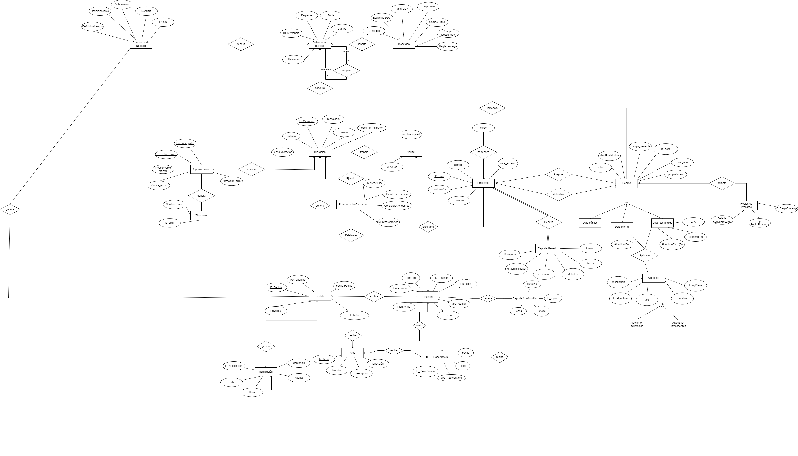

# Modelo Conceptual

Definición de las relaciones de las diferentes entidades involucradas en el proceso de negocio con sus respectivos atributos.

## Diccionario de Datos

### Entidad: Pedido

 Representa un pedido realizado por los usuarios de origen, generados de un reunión previa, para migrar tablas específicas de una base de datos a otra.

| Atributo | Tipo | Naturaleza | Definición  |
| --------- | -------------------------------------------------- | ------------------- | ------------ |
| ID_Pedido | CLAVE | INT | Identificador del pedido realizado |
| Prioridad | SIMPLE | CHAR | 	Prioridad asignada al pedido |
| Estado | SIMPLE | DATE | Estado actual del pedido |
| Fecha Pedido | SIMPLE | DATE | Fecha en que se realizó el pedido |
| Fecha Limite | SIMPLE | DATE | Fecha límite para completar el pedido |

### Entidad: Área

 Representa las áreas funcionales de la empresa interesadas en pedir un proceso de migración de datos. 

| Atributo | Tipo | Naturaleza | Definición  |
| --------- | -------------------------------------------------- | ------------------- | ------------ |
| ID_Area | CLAVE | INT | Identificador de un área de la empresa |
| Nombre | SIMPLE | CHAR | Nombre del área funcional de la empresa |
| Descripción | SIMPLE | CHAR |Descripción del área |
| Dirección | SIMPLE | CHAR | 	Dirección del correo electrónico asociada al área |

### Entidad: Migración

Representa el proceso de trasladar campos específicos de las tablas de una base de datos a otra como parte de un pedido de migración.

| Atributo | Tipo | Naturaleza | Definición  |
| --------- | -------------------------------------------------- | ------------------- | ------------ |
| ID_Migración | CLAVE | INT | Identificador de la migración |
| Entorno | SIMPLE | CHAR | Esquema modelado con la tabla equivalente |
| Fecha Migración | SIMPLE | DATE |Fecha que se realizo la migración |
| Tecnología | SIMPLE | CHAR | Tecnología  asociada a la migración |
| Valido | SIMPLE | BOOL | Indica si la migración está activa o no |

### Entidad: Notificación

Representa las notificaciones generadas en el proceso de migración de datos para los distintos squads. 

| Atributo | Tipo | Naturaleza | Definición  |
| --------- | -------------------------------------------------- | ------------------- | ------------ |
| Id_Notificacion | CLAVE | INT | Identificador de la notificación |
| Asunto | SIMPLE | DATE | Asunto de la notificación |
| Contenido | SIMPLE | CHAR | Mensaje de la notificación |
| Fecha | SIMPLE | CHAR | Fecha de la notificación |
| Hora | SIMPLE | BOOL | Hora de la notificación |

### Entidad: Empleado

| Atributo | Tipo | Naturaleza | Definción  |
| --------- | -------------------------------------------------- | ------------------- | ------------ |
| id_empleado | Clave | INT | Identificador único del empleado. |
| nombre_empleado | Simple | CHAR | Nombre del empleado. |
| correo | Simple | CHAR | Correo asignado al empleado.|
| contraseña | Simple | CHAR | Contraseña asignado al empleado. |
| nivel_acceso | Simple | CHAR |Nivel de acceso del empleado en el sistema (baja, media, alta, muy alta) |

## Entidad: Squad
| Atributo | Tipo | Naturaleza | Definción  |
| --------- | -------------------------------------------------- | ------------------- | ------------ |
| id_squad 1 clave | INT | Identificador unico del squad.|
|nombre_squad | simple | char | Nombre de los diferentes squad. |

## Relacion: pertenece
Relacion que asigna a cada empleado dentro del squad un cargo distinto.

### Entidad: Administrador

| Atributo | Tipo | Naturaleza | Definción  |
| --------- | -------------------------------------------------- | ------------------- | ------------ |
| ADM_Id | Clave | INT | Identificador único del administrador del sistema. |
| ADM_NivelAcceso | Simple | CHAR | Nivel de privilegios del administrador. |
| ADM_Nombre | Simple | CHAR | Nombre del administrador del sistema registrado. |
| ADM_Area | Simple | CHAR | Area de gestión al que pertenece el adminstrador. |
| ADM_Password | Simple | CHAR | Contraseña de acceso del administrador del sistema. |

### Entidad: ServicioSeguridad

| Atributo | Tipo | Naturaleza | Definción  |
| --------- | -------------------------------------------------- | ------------------- | ------------ |
| SeS_Id | Clave | INT | Identificador único del servicio de seguridad configurado. |
| SeS_Nombre | Simple | CHAR | Nombre del servicio de seguridad de datos. |
| SeS_Descripcion | Simple | CHAR | Descripción del servicio de seguridad. |
| SeS_Estado | Simple | CHAR | Estado actual del servicio de seguridad. |
| SeS_Configuracion | Simple | CHAR | Estado de configuración del servicio de seguridad. |
| SeS_UltimaActualizacion | Simple | FECHA | Última fecha de actualización del servicio. |

### Entidad: Conceptos de negocio

| Atributo | Tipo | Naturaleza | Definción  |
| --------- | -------------------------------------------------- | ------------------- | ------------ |
|ID_CN| Clave | INT | Identificador único del concepto de negocio |
|CN_Dominio| Simple | CHAR | Dominio de información en el que se esta trabajando. |
|CN_Subdominio| Simple |CHAR| Agrupaciones del dominio de información en el que se esta trabajando. |
|CN_DefinicionCampo|Simple|CHAR|Descripción completa y detallada del campo de referencia.|
|CN_DefinicionTabla|Simple|CHAR|Descripción completa y detallada de la tabla de referencia. |

### Entidad: Definiciones Técnicas

| Atributo | Tipo | Naturaleza | Definción  |
| --------- | -------------------------------------------------- | ------------------- | ------------ |
|ID_DT| Clave | INT | Identificador único de la definición técnica.|
|Esquema |Simple| CHAR |Nombre del esquema de referencia o en la nube.|
|Tabla |Simple| CHAR | Nombre de la tabla de referencia o en la nube|
|Campo|Simple| CHAR |Nombre del campo de referencia o en la nube.|
|Universo|Simple|CHAR| Descripcion del universo relacionado a cada definicion tecnica.|

## Relación: mapeo
Relacion recursiva, dónde una definición tecnica puede ser mapeado o mapear.

### Entidad: ReglasDeCarga

| Atributo | Tipo | Naturaleza | Definición  |
| --------- | -------------------------------------------------- | ------------------- | ------------ |
| Id_Precarga | SIMPLE | INT | Identificador único de cada regla de precarga |
| DetallePreCarga | SIMPLE | CHAR | Detalle de la regla de precarga |
| TipoPreCarga | SIMPLE | CHAR | Tipo de regla de precarga |

### Entidad: Tipo_error

| Atributo          | Tipo   | Naturaleza | Definición                         |
|-------------------|--------|------------|-------------------------------------|
| Id_error   | CLAVE | VARCHAR       | Identificador único del tipo de error      |
| Nombre errror    | SIMPLE | CHAR       | Indica el nombre de error, por ejemplo error de modelamiento, sintaxis, etc.      |

### Entidad: Reunión

Esta entidad representa las reuniones relacionadas con los pedidos de migración de datos.

| Atributo | Tipo | Naturaleza | Definición |
| --- | --- | --- | --- |
| ID_Reunion | CLAVE | INT | Identificador único de la reunión. |
| Hora_Inicio | SIMPLE | TIMESTAMP | Momento en el que la reunión comienza. |
| Hora_Fin | SIMPLE | TIMESTAMP | Momento en el que la reunión termina. |
| Plataforma | SIMPLE | CHAR | Plataforma utilizada para la reunión. |
| Fecha | SIMPLE | DATE | Fecha en la que se lleva a cabo la reunión. |
| Tipo_Reunion | SIMPLE | INT | Indica el tipo de reunión (de entrada, de salida). |
| Duración | DERIVADO |  | Duración de la reunión, calculada a partir de Hora_Inicio y Hora_Fin. |

### Entidad: Recordatorio

Esta entidad representa los recordatorios asociados a las reuniones.

| Atributo | Tipo | Naturaleza | Definición |
| --- | --- | --- | --- |
| ID_Recordatorio | CLAVE | INT | Identificador único del recordatorio |
| Hora | SIMPLE | TIMESTAMP | Hora en la que se envía el recordatorio |
| Fecha | SIMPLE | DATE | Fecha en la que se envía el recordatorio |
| tipo_Recordatorio | SIMPLE | INT | Tipo de recordatorio, indicando el motivo o contenido del mensaje |

### Entidad: Reporte Conformidad

Esta entidad representa los reportes de conformidad generados después de las reuniones de salida para verificar el cumplimiento de los objetivos establecidos.

| Atributo | Tipo | Naturaleza | Definición |
| --- | --- | --- | --- |
| ID_Reporte | CLAVE | INT | Identificador único del reporte de conformidad |
| Detalles | SIMPLE | TEXT | Detalles o conclusiones del reporte de conformidad |
| Fecha | SIMPLE | DATE | Fecha en la que se generó el reporte de conformidad |
| Estado | SIMPLE | CHAR | Estado del reporte, indicando si está completo o pendiente de revisión |

### Entidad: Programacion de carga

Esta entidad sirve para saber cuándo y en que  intervalos se darán la ejecución de los campos.

| Atributo          | Tipo   | Naturaleza | Definición                         |
|-------------------|--------|------------|-------------------------------------|
 Programacion_Id        | CLAVE | INT       | Es el identificador único de la programación de ejecucuión de los campos.   |
| FrecuenciaEjecucion        | SIMPLE | CHAR       | Es la frecuencia que se ejecutaran los campos.   |
| DetalleFrecuencia| SIMPLE | CHAR       | Día de la semana en la que empieza y termina la ejecución del campo.       |
| ConsideracionFrecuencia        | SIMPLE | CHAR       | Comentario alusivo a la frecuencia de ejecución.|

### Entidad: Registro de errores

Esta entidad va a guardar todos los registros de errores que hayan durante el procesocon su detalle.

| Atributo          | Tipo   | Naturaleza | Definición                         |
|-------------------|--------|------------|-------------------------------------|
| Id_registro_errores   | CLAVE | INT       | Identificador único del error   |
| Fecha_registro| SIMPLE | DATE       | Es la fecha con día, mes y año en la que se registra un error |
| Responsable_regsitro        | SIMPLE | CHAR       |Es el empleado que hace el registro del error|
| Causa_error        | SIMPLE | CHAR       |Es la causa del porqué se le considera error|
| Correccion_error       | SIMPLE | CHAR       |Es la corrección del error |

Entidad: Campo
Representa el registro de metadatos relacionados con un dato mapeado en el proceso de migración de BCP.

| Atributo  | Tipo   | Naturaleza | Definición |
|------------------|--------|------------|---------|
| id_campo | CLAVE  | INT | Identificador único del campo |
| ID_Modelo | SIMPLE | INT | Identificador del modelo asociado |
| id_TipodeDato | SIMPLE | INT | Identificador del tipo de dato |
| valor | SIMPLE | CHAR | Valor del campo |
| propiedades | SIMPLE | TEXT | Propiedades adicionales del campo en formato JSON |
| id_AlgoritmoEnc | SIMPLE | INT | Identificador del algoritmo de encriptación |
| id_AlgoritmoEnm | SIMPLE | INT | Identificador del algoritmo de enmascaramiento (puede ser NULL si no aplica) |

Entidad: Algoritmo
Representa el algoritmo de encriptado o enmascarado que se le aplicarán a los datos sensibles.

| Atributo | Tipo   | Naturaleza | Definición |
|-------------------|--------|------------|------------|
| id_algoritmo | CLAVE  | INT | Identificador único del algoritmo |
| nombre_algoritmo | SIMPLE | CHAR | Nombre del algoritmo |
| descripcion | SIMPLE | CHAR | Descripción del algoritmo |
| longClave | SIMPLE | CHAR | Longitud de la clave utilizada en el algoritmo |
| tipo | SIMPLE | CHAR | Tipo de algoritmo (encriptación o enmascaramiento) |

Entidad: CampoAsegurado
Representa los campos asegurados administrados por un administrador.

| Atributo | Tipo   | Naturaleza | Definición |
|-------------------|--------|------------|-------|
| id_CampoAsegurado | CLAVE  | INT | Identificador único del campo asegurado |
| id_admin | SIMPLE | INT | Identificador del administrador |
| id_campo | SIMPLE | INT | Identificador del campo |

Entidad: Reporte
Representa el reporte de rendimiento acerca de un usuario del sistema.

| Atributo   | Tipo   | Naturaleza | Definición |
|------------|--------|------------|--------------|
| id_reporte | CLAVE  | INT | Identificador único del reporte |
| id_admin | SIMPLE | INT | Identificador del administrador |
| id_usuario | SIMPLE | INT | Identificador del usuario |
| detalles | SIMPLE | CHAR | Detalles del reporte |
| fecha | SIMPLE | DATE | Fecha del reporte |
| formato | SIMPLE | CHAR | Formato del reporte (pdf, xlsx, etc.) |

[Regresar al índice](Indice.md)
