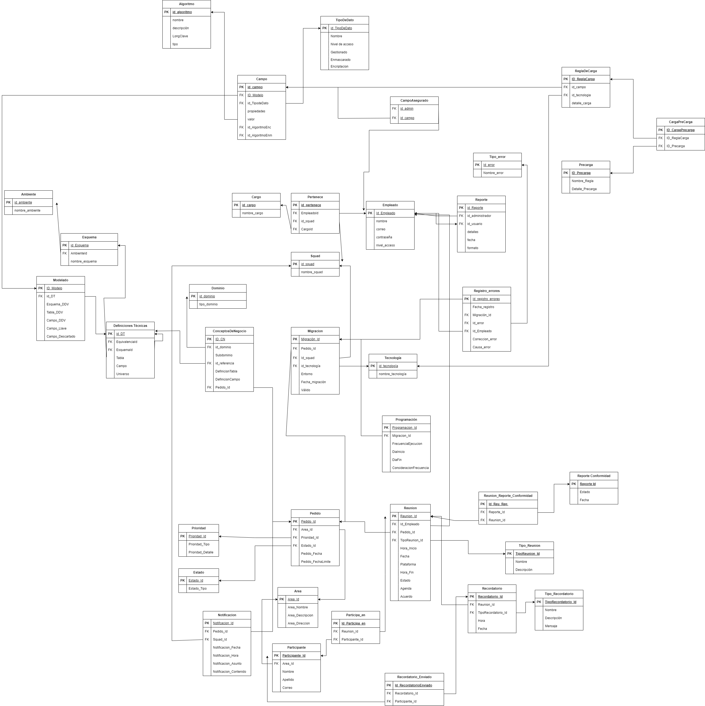

# Modelo Lógico 

## Diccionario de Datos

### Entidad: Pedido

 Representa un pedido realizado por los usuarios de origen, generados de un reunión previa, para migrar tablas específicas de una base de datos a otra.

| Campo | Tipo | Descripción |
| --- | --- | --- |
| Pedido_Id | serial  | Identificador único del pedido  |
| Reunion_Id | serial | Identificador de la reunión asociada al pedido |
| Prioridad_Id | serial | Identificador de la prioridad del pedido |
| Estado_Id | serial | Identificador del estado del pedido |
| Pedido_Fecha | date | Fecha de creación del pedido |
| Pedido_FechaLimite | date | Fecha límite para el pedido |

### Entidad: Prioridad

Enumera todos los posibles valores que tendría la prioridad del pedido.

| Campo | Tipo | Descripción |
| --- | --- | --- |
| Prioridad_Id   | serial  | Identificador único de la prioridad |
| Prioridad_Tipo | varchar(5) | Tipo de prioridad |
| Prioridad_Detalle | varchar(250) | Detalle o descripción de la prioridad |

### Entidad: Estado

Enumera todos los posibles valores que tendría el estado del pedido.

| Campo | Tipo | Descripción |
| --- | --- | --- |
| Estado_Id | serial | Identificador único del estado |
| Estado_Tipo | varchar(10) | Tipo de estado |

### Entidad: Área

 Representa las áreas funcionales de la empresa interesadas en pedir un proceso de migración de datos. 

| Campo | Tipo | Descripción |
| --- | --- | --- |
| Area_Id | serial | Identificador único del área |
| Area_Nombre | varchar(100) | Nombre del área |
| Area_Descripcion | varchar(100) | Descripción del área |
| Area_Direccion | varchar(50) | Dirección física del área |

### Entidad: Migración

Representa el proceso de trasladar campos específicos de las tablas de una base de datos a otra como parte de un pedido de migración.

| Campo | Tipo | Descripción |
| --- | --- | --- |
| Migracion_Id | serial | Identificador único de la migración  |
| Pedido_Id | serial | Identificador del pedido asociado a la migración |
| Id_Squad | serial | Identificador del equipo asociado a la migración |
| Id_Tecnologia | serial | Identificador de la tecnología utilizada en la migración |
| Entorno | varchar(50) | Entorno de la migración |
| Fecha_migracion | date | Fecha en la que se realizó la migración |
| Valido | boolean | Indica si la migración es válida o no |

### Entidad: Tecnologia

 Enumera todos los las tecnologías que se puede usar al monmento de migrar un campo.

| Campo | Tipo | Descripción |
| --- | --- | --- |
| id_tecnologia | serial | Identificador único de la tecnología |
| nombre_tecnologia | varchar(50) | Nombre de la tecnología |

### Entidad: Notificación

Representa las notificaciones generadas en el proceso de migración de datos para los distintos squads.

| Campo | Tipo | Descripción |
| --- | --- | --- |
| Notificacion_Id | serial | Identificador único de la notificación |
| Pedido_Id | serial | Identificador del pedido asociado a la notificación |
| Squad_Id | serial | Identificador del equipo asociado a la notificación |
| Notificacion_Fecha | date | Fecha de la notificación |
| Notificacion_Hora | time | Hora de la notificación |
| Notificacion_Asunto | varchar(50) | Asunto o título de la notificación |
| Notificacion_Contenido | varchar(250) | Contenido o mensaje de la notificación |

### Entidad: Empleado
| Campo | Tipo | Descripción |
| --- | --- | --- |
| id_empleado | serial | Identificador único del empleado. |
| nombre |varchar(50) | Nombre del empleado. |
| correo | varchar(50)| Correo del empleado.|
| contraseña | varchar (50) | Contraseña del empleado. |
| nivel_acceso| varchar(50) | Indica el nivel de acceso que tiene el empleado en el sistema.|
| telefono | varchar(20) | Teléfono del empleado.|
| dni | varchar(8) | Documento Nacional de Identidad del empleado.|

### Entidad: Cargo
| Campo | Tipo | Descripción |
| --- | --- | --- |
| id_cargo | serial | Identificador único del cargo.|
| nombre_cargo | varchar(50) |Nombre de cada cargo existente dentro del squad. |

### Entidad: Squad
| Campo | Tipo | Descripción |
| --- | --- | --- |
| id_squad | serial | Identificador unico del squad. | 
| nombre_squad | varchar(50) | Nombre de cada squad existente. |

### Entidad: Pertenece
| Campo | Tipo | Descripción |
| --- | --- | --- |
|id_pertenece | serial | Identificador único de la relación pertenece. |
|SquadId| serial | Identificador del squad involucrado en la relación. |
|EmpleadoId | serial | Identificador del empleado involucrado en la relación. |
|CargoId| serial | Identificador del cargo relacionado al empleado perteneciente a un squad.|

### Entidad: Dominio
| Campo | Tipo | Descripción |
| --- | --- | --- |
| id_dominio |serial | Identificador único del dominio.|
| tipo_dominio | varchar(50) | Nombre del tipo de dominio.| 

### Entidad: Ambiente
| Campo | Tipo | Descripción |
| --- | --- | --- |
|id_ambiente|serial|Identificador unico del ambiente desde el cual se migra.|
|nombre_ambiente|varchar(100)|Nombre del ambiente desde el cual se migra.|

### Entidad: Esquema
| Campo | Tipo | Descripción |
| --- | --- | --- |
|id_Esquema|serial|Identificador único del esquema relacionado al ambiente desde el cual se migra.|
|AmbienteId|serial|Identificador del ambiente relacionado al esquema.|
|nombre_esquema|varchar(100)|Nombre del esquema.|

### Entidad: Modelado
| Campo | Tipo | Descripción |
| --- | --- | --- |
|ID_Modelo|serial|Identificador único del modelo realizado.|
|EsquemaDDV|varchar(200)|Nombre asignado al esquema DDV dentro del modelo realizado.|
|TablaDDV|varchar(200)|Nombre asignado a la tabla DDV dentro del modelo realizado.|
|CampoDDV|varchar(200)|Nombre asignado al campo DDV dentro del modelo realizado.|
|CampoLlave|boolean|Indicador de si el campo es llave o no.|
|Campo_Descarta|boolean|Indicador de si el campo se descarto para el modelo o no.|

### Entidad: Definiciones Tecnicas
| Campo | Tipo | Descripción |
| --- | --- | --- |
|id_DT|serial|Identificador unico de la definicion tecnica.|
|EquivalenciaId|serial|Identificador de la definicion tecnica equivalente a otra.|
|ModeloId|serial|Identificador del modelo relacionado a la definicion tecnica.|
|EsquemaId|serial|Identificador del esquema relacionado a la defincion tecnica.|
|Tabla|varchar(200)|Nombre de la tabla a migrar.|
|Campo|varchar(100)|Nombre de los campos pertenecientes a cada tabla por migrar.|

## Entidad: Conceptos de Negocio
| Campo | Tipo | Descripción |
| --- | --- | --- |
|id_CN|serial|Identificador unico del concepto de negocio.|
|id_dominio|serial|Identificador del dominio de información al que esta relacionado|
|subdominio|varchar(100)|nombre del subdominio, asignado por los usuarios dependiendo del dominio.|
|id_referencia|serial|Identificador de la información mapeada en las definiciones tecnicas|
|DefinicionTabla|text|Definicion de la tabla mapeada en las definiciones tecnicas.|
|DefinicionCampo|text|Definicion del campo mapeado en las definiciones tecnicas.|
|PedidoId|serial|Identificador del pedido en base al cual se generó el concepto de negocio.|

### Entidad: Reglas de Carga

| Campo | Tipo | Descripción |
| --- | --- | --- |
| ID_ReglaCarga | serial | Identificador único de la regla de carga  |
| id_campo | serial | Identificador del campo al que se le aplicará la regla de carga |
| id_tecnologia | serial| Identificador del tipo de tecnología que se usará para elaborar la regla de carga|
| detalle_carga | text| Detalle de la regla de carga|

### Entidad: PreCarga

| Campo | Tipo | Descripción |
| --- | --- | --- |
| ID_Precarga | serial | Identificador único de la regla de precarga  |
| Nombre_Regla | varchar(30) | Nombre de la regla de precarga |
| Detalle_Precarga | varchar(50)| Descripcion de la regla de precarga|

### Entidad: CargaPreCarga

| Campo | Tipo | Descripción |
| --- | --- | --- |
| ID_CargaPrecarga | serial | Identificador único de la relacion, compuesto por los dos foreign keys  |
| ID_ReglaCarga | serial | Identificador de la regla de carga |
| ID_Precarga | serial| Identificador de la regla de Precarga|

## Tabla: Reunion

Almacena la información sobre las reuniones, como su título, hora de inicio y finalización, plataforma utilizada, fecha, estado, agenda y acuerdos.

| Campo            | Tipo    | Descripción                                       |
|------------------|---------|---------------------------------------------------|
| Reunion_Id       | serial  | Identificador único de la reunión.                |
| Id_Empleado      | serial  | Identificador del empleado asociado a la reunión. |
| Pedido_Id        | serial  | Identificador del pedido relacionado.             |
| TipoReunion_Id   | serial  | Identificador del tipo de reunión.                |
| Hora_Inicio      | time    | Momento en el que la reunión comienza.            |
| Hora_Fin         | time    | Momento en el que la reunión termina.             |
| Plataforma       | varchar(50) | Plataforma utilizada para la reunión.             |
| Fecha            | date    | Fecha en la que se lleva a cabo la reunión.       |
| Estado           | varchar(20) | Estado de la reunión (pendiente, completada).     |
| Agenda           | text    | Agenda de la reunión.                             |
| Acuerdos         | text    | Acuerdos alcanzados en la reunión.                |

## Tabla: Reporte_Conformidad

Contiene los reportes de conformidad generados, incluyendo su estado (pendiente o completado) y la fecha de generación.

| Campo       | Tipo    | Descripción                                           |
|-------------|---------|-------------------------------------------------------|
| Reporte_Id  | serial  | Identificador único del reporte de conformidad.      |
| Estado      | varchar(15) | Estado del reporte de conformidad (pendiente, completado). |
| Fecha       | date    | Fecha en la que se generó el reporte de conformidad.  |

## Tabla: Tipo_Reunion

Describe los tipos de reunión disponibles , con su respectivo nombre (entrada o salida) y descripción.

| Campo          | Tipo    | Descripción                           |
|----------------|---------|---------------------------------------|
| TipoReunion_Id | serial  | Identificador único del tipo de reunión. |
| Nombre         | varchar(10) | Nombre del tipo de reunión.          |
| Descripcion    | text    | Descripción del tipo de reunión.     |

## Tabla: Recordatorio

Registra los recordatorios asociados a las reuniones, incluyendo su hora y fecha de envío, y el tipo de recordatorio.

| Campo              | Tipo    | Descripción                                       |
|--------------------|---------|---------------------------------------------------|
| Recordatorio_Id    | serial  | Identificador único del recordatorio.             |
| Reunion_Id         | serial  | Identificador de la reunión asociada.            |
| TipoRecordatorio_Id| serial  | Identificador del tipo de recordatorio.           |
| Hora               | time    | Hora del recordatorio.                            |
| Fecha              | date    | Fecha del recordatorio.                           |

## Tabla: Tipo_Recordatorio
Define los diferentes tipos de recordatorios disponibles, con su nombre, descripción y mensaje predeterminado.

| Campo              | Tipo    | Descripción                              |
|--------------------|---------|------------------------------------------|
| TipoRecordatorio_Id| serial  | Identificador único del tipo de recordatorio. |
| Nombre             | varchar(50) | Nombre del tipo de recordatorio.        |
| Descripcion        | text    | Descripción del tipo de recordatorio.   |
| Mensaje            | text    | Mensaje predeterminado del recordatorio.|

## Tabla: Participante

Almacena información sobre los participantes de las reuniones, como su nombre, apellido, correo electrónico y área a la que pertenecen.

| Campo            | Tipo    | Descripción                                       |
|------------------|---------|---------------------------------------------------|
| Participante_Id  | serial  | Identificador único del participante.            |
| Area_Id          | serial  | Identificador del área del participante.         |
| Nombre           | varchar(50) | Nombre del participante.                         |
| Apellido         | varchar(50) | Apellido del participante.                       |
| Correo           | varchar(50) | Correo electrónico del participante.             |

## Tabla: Participa_en

Establece la relación entre las reuniones y los participantes, registrando quiénes participan en cada reunión.

| Campo            | Tipo    | Descripción                                       |
|------------------|---------|---------------------------------------------------|
| Id_Participa_en  | serial  | Identificador único de la participación.         |
| Reunion_Id       | serial  | Identificador de la reunión (clave foránea).     |
| Participante_Id  | serial  | Identificador del participante (clave foránea).  |

## Tabla: Recordatorio_Enviado

Registra los recordatorios enviados a los participantes, relacionando el recordatorio con el participante destinatario.

| Campo                | Tipo    | Descripción                                       |
|----------------------|---------|---------------------------------------------------|
| Id_RecordatorioEnviado | serial | Identificador único del recordatorio enviado.  |
| Recordatorio_Id      | serial | Identificador del recordatorio asociado.       |
| Participante_Id      | serial | Identificador del participante destinatario.  |

## Tabla: Reunion_Reporte_Conformidad

Establece la relación entre las reuniones y los reportes de conformidad, indicando qué reuniones están asociadas a cada reporte.

| Campo                         | Tipo    | Descripción                                       |
|-------------------------------|---------|---------------------------------------------------|
| Id_Reu_Rep                    | serial  | Identificador único de la relación entre reunión y reporte de conformidad. |
| Reporte_Id                    | serial  | Identificador único del reporte de conformidad (clave foránea). |
| Reunion_Id                    | serial  | Identificador único de la reunión relacionada (clave foránea). |

### Entidad: Registro_errores

Representa el proceso de registrar los errores por cada empleado que haya hecho su correción de acuerdo al error cometido.

| Campo | Tipo | Descripción |
| --- | --- | --- |
| Id_registro_errores | serial | Identificador único del registro del error  |
| Migracion_Id | serial | Identificador de la migración asociado al registro de error |
| Id_error | serial | Identificador del tipo de error donde se guardará  cada registro. |
| Id_Empleado | serial | Identificador del empleado que hace un registro del error |
| Correccion_error | varchar(50) | Es la descripción de cómo se corrigió|
| Fecha_registro | date | Fecha en la que se guarda el registro de error |
| Causa_error | varchar(50)| Descripción de porqué se le considera error|

### Entidad: Tipo error

| Campo | Tipo | Descripción |
| --- | --- | --- |
| Id_error | serial | Identificador único del tipo de error |
| Nombre_error | varchar(50) | Nombre del tipo de error|

### Entidad: Programacion

| Campo | Tipo | Descripción |
| --- | --- | --- |
| Programacion_Id | serial | Identificador único de la programación de carga  |
| Migracion_Id | serial | Identificador de la migración asociado al registro de error |
| FrecuenciaEjecucion | varchar(50)| Es la frecuencia la cual se cambiarán los campos|
| DiaInicio | varchar(50)| Día en la que empieza la ejecución de los campos|
| DiaFin | varchar(50)| Día en la que termina la ejecución de los campos|
| ConsideracionFrecuencia | varchar(50)| Comentario alusivo a la ejecución, puede ser alguna restricción|

### Entidad: Campo

Representa el registro de metadatos relacionados con un dato mapeado en el proceso de migración de BCP.

| Campo | Tipo | Descripción |
| --- | --- | --- |
| id_campo	 | serial | Identificador único del campo |
| ID_Modelo | serial | Identificador del modelo asociado |
| id_TipodeDato | serial | Identificador del tipo de dato |
| valor | varchar(100)| Valor del campo |
| propiedades | varchar(50)| Propiedades adicionales del campo en formato JSON |
| id_AlgoritmoEnc | varchar(50)| Identificador del algoritmo de encriptación |
| id_AlgoritmoEnm | varchar(50)| Identificador del algoritmo de enmascaramiento (puede ser NULL si no aplica) |

### Entidad: Algoritmo

Representa el algoritmo de encriptado o enmascarado que se le aplicarán a los datos sensibles.

| Campo | Tipo | Descripción |
| --- | --- | --- |
| id_algoritmo | serial | Identificador único del algoritmo |
| nombre_algoritmo | varchar(20)	 | Identificador del modelo asociado |
| descripcion | varchar(50)	 | Identificador del tipo de dato |
| longClave | varchar(10)	| Valor del campo |
| tipo | varchar(20) | Valor del campo |

### Entidad: CampoAsegurado

Representa los campos asegurados administrados por un administrador.

| Campo | Tipo | Descripción |
| --- | --- | --- |
| id_CampoAsegurado | serial | Identificador único del campo asegurado |
| id_admin | serial | Identificador del administrador |
| id_campo | serial | Identificador del campo |

### Entidad: Reporte

Representa el reporte de rendimiento acerca de un usuario del sistema.

| Campo | Tipo | Descripción |
| --- | --- | --- |
| id_reporte | serial | Identificador único del reporte |
| id_admin | serial | Identificador del administrador |
| id_usuario | serial | Identificador del usuario |
| detalles | varchar(50) | Detalles del reporte |
| fecha | date | Fecha del reporte |
| formato | varchar(15) | Formato del reporte (pdf, xlsx, etc.) |

[Regresar al índice](Indice.md)
