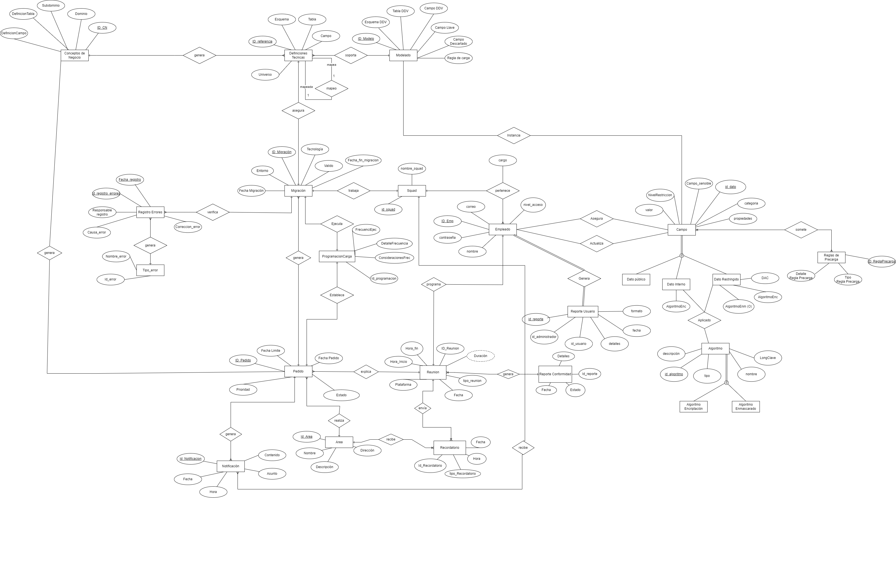

# Modelo Conceptual

Definición de las relaciones de las diferentes entidades involucradas en el proceso de negocio con sus respectivos atributos.

## Diccionario de Datos

### Entidad: Pedido

 Representa un pedido realizado por los usuarios de origen, generados de un reunión previa, para migrar tablas específicas de una base de datos a otra.

| Atributo | Tipo | Naturaleza | Definición  |
| --------- | -------------------------------------------------- | ------------------- | ------------ |
| ID_Pedido | CLAVE | INT | Identificador del pedido realizado |
| Prioridad | SIMPLE | CHAR | 	Prioridad asignada al pedido |
| Estado | SIMPLE | DATE | Estado actual del pedido |
| Fecha Pedido | SIMPLE | DATE | Fecha en que se realizó el pedido |
| Fecha Limite | SIMPLE | DATE | Fecha límite para completar el pedido |

### Entidad: Área

 Representa las áreas funcionales de la empresa interesadas en pedir un proceso de migración de datos. 

| Atributo | Tipo | Naturaleza | Definición  |
| --------- | -------------------------------------------------- | ------------------- | ------------ |
| ID_Area | CLAVE | INT | Identificador de un área de la empresa |
| Nombre | SIMPLE | CHAR | Nombre del área funcional de la empresa |
| Descripción | SIMPLE | CHAR |Descripción del área |
| Dirección | SIMPLE | CHAR | 	Dirección del correo electrónico asociada al área |

### Entidad: Migración

Representa el proceso de trasladar campos específicos de las tablas de una base de datos a otra como parte de un pedido de migración.

| Atributo | Tipo | Naturaleza | Definición  |
| --------- | -------------------------------------------------- | ------------------- | ------------ |
| ID_Migración | CLAVE | INT | Identificador de la migración |
| Entorno | SIMPLE | CHAR | Esquema modelado con la tabla equivalente |
| Fecha Migración | SIMPLE | DATE |Fecha que se realizo la migración |
| Tecnología | SIMPLE | CHAR | Tecnología  asociada a la migración |
| Valido | SIMPLE | BOOL | Indica si la migración está activa o no |

### Entidad: Notificación

Representa las notificaciones generadas en el proceso de migración de datos para los distintos squads. 

| Atributo | Tipo | Naturaleza | Definición  |
| --------- | -------------------------------------------------- | ------------------- | ------------ |
| Id_Notificacion | CLAVE | INT | Identificador de la notificación |
| Asunto | SIMPLE | DATE | Asunto de la notificación |
| Contenido | SIMPLE | CHAR | Mensaje de la notificación |
| Fecha | SIMPLE | CHAR | Fecha de la notificación |
| Hora | SIMPLE | BOOL | Hora de la notificación |

### Entidad: ReglasCalidad

| Atributo | Tipo | Naturaleza | Definición  |
| --------- | -------------------------------------------------- | ------------------- | ------------ |
| ID_ReglaPrecarga | SIMPLE | CHAR | Detalle de la regla de precarga |
| Detalle_Regla_Precarga | SIMPLE | CHAR | Detalle de la regla de precarga |
| Nombre_Regla_Precarga | SIMPLE | CHAR | Tipo de regla de PreCarga |

### Entidad: Programacion de carga

Esta entidad sirve para saber cuándo y en que  intervalos se darán la ejecución de los campos.

| Atributo          | Tipo   | Naturaleza | Definición                         |
|-------------------|--------|------------|-------------------------------------|
 Programacion_Id        | CLAVE | INT       | Es el identificador único de la programación de ejecucuión de los campos.   |
| FrecuenciaEjecucion        | SIMPLE | CHAR       | Es la frecuencia que se ejecutaran los campos.   |
| DetalleFrecuencia| SIMPLE | CHAR       | Día de la semana en la que empieza y termina la ejecución del campo.       |
| ConsideracionFrecuencia        | SIMPLE | CHAR       | Comentario alusivo a la frecuencia de ejecución.|

### Entidad: Registro de errores

Esta entidad va a guardar todos los registros de errores que hayan durante el procesocon su detalle.

| Atributo          | Tipo   | Naturaleza | Definición                         |
|-------------------|--------|------------|-------------------------------------|
| Id_registro_errores   | CLAVE | INT       | Identificador único del error   |
| Fecha_registro| SIMPLE | DATE       | Es la fecha con día, mes y año en la que se registra un error |
| Responsable_registro        | SIMPLE | CHAR       |Es el empleado que hace el registro del error|
| Causa_error        | SIMPLE | CHAR       |Es la causa del porqué se le considera error|
| Correccion_error       | SIMPLE | CHAR       |Es la corrección del error |

### Entidad: CampoAsegurado
Representa los campos asegurados administrados por un administrador.

| Atributo | Tipo   | Naturaleza | Definición |
|-------------------|--------|------------|-------|
| id_CampoAsegurado | CLAVE  | INT | Identificador único del campo asegurado |
| id_admin | SIMPLE | INT | Identificador del administrador |
| id_campo | SIMPLE | INT | Identificador del campo |

### Entidad: Tipo_error

| Atributo          | Tipo   | Naturaleza | Definición                         |
|-------------------|--------|------------|-------------------------------------|
| Id_error   | CLAVE | VARCHAR       | Identificador único del tipo de error      |
| Nombre errror    | SIMPLE | CHAR       | Indica el nombre de error, por ejemplo error de modelamiento, sintaxis, etc.      |

### Entidad: Conceptos de negocio

| Atributo | Tipo | Naturaleza | Definción  |
| --------- | -------------------------------------------------- | ------------------- | ------------ |
|ID_CN| Clave | INT | Identificador único del concepto de negocio |
|CN_Dominio| Simple | CHAR | Dominio de información en el que se esta trabajando. |
|CN_Subdominio| Simple |CHAR| Agrupaciones del dominio de información en el que se esta trabajando. |
|CN_DefinicionCampo|Simple|CHAR|Descripción completa y detallada del campo de referencia.|
|CN_DefinicionTabla|Simple|CHAR|Descripción completa y detallada de la tabla de referencia. |

### Entidad: Definiciones Técnicas

| Atributo | Tipo | Naturaleza | Definción  |
| --------- | -------------------------------------------------- | ------------------- | ------------ |
|ID_DT| Clave | INT | Identificador único de la definición técnica.|
|Esquema |Simple| CHAR |Nombre del esquema de referencia o en la nube.|
|Tabla |Simple| CHAR | Nombre de la tabla de referencia o en la nube|
|Campo|Simple| CHAR |Nombre del campo de referencia o en la nube.|
|Universo|Simple|CHAR| Descripcion del universo relacionado a cada definicion tecnica.|

## Relación: mapeo
Relacion recursiva, dónde una definición tecnica puede ser mapeado o mapear.

### Entidad: Modelo DDV

| Atributo | Tipo | Naturaleza | Definición  |
| --------- | -------------------------------------------------- | ------------------- | ------------ |
| ID_MODELO | CLAVE | CHAR | Identificador del modelo DDV diseñado |
| EsquemaDDV | SIMPLE | CHAR | Esquema modelado con la tabla equivalente |
| TablaDDV | SIMPLE | CHAR | Tabla modelada con la tabla equivalente |
| CampoDDV | SIMPLE | CHAR | Campo modelado con la tabla equivalente |
| Tipología | SIMPLE | CHAR | Tipología del modelo, normalmente tablón. |
| IM_LlaveEntidad | SIMPLE | BOOL | Indica si el campo es primario para el modelo |
| Descarte | SIMPLE | BOOL | Indica si el campo es descartado para la carga |

[Regresar al índice](Indice.md)
