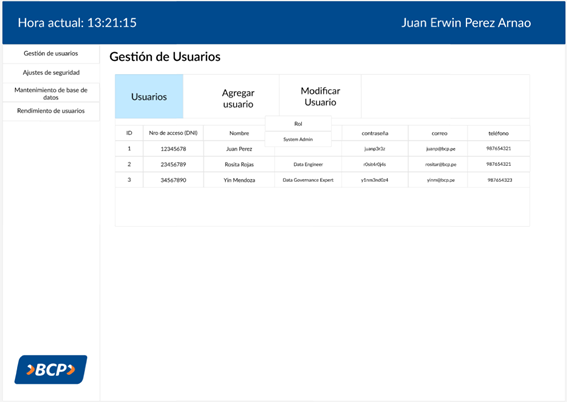

# Prototipo

## Gestión de Usuarios

### Visualización de Usuarios

#### **I-001**

**Requerimiento:** R-001

**Entidades:** Empleado, Roles

* El usuario puede visualizar la lista de niveles de acceso y generar nuevas credenciales para los usuarios.

 

### Modificación de Usuarios

#### **I-002**

**Requerimiento:** R-002

**Entidades:** Empleado, Roles

* El usuario puede visualizar la lista de usuarios y generar nuevas contraseñas aleatorias para ellos.

 

### Visualización de Empleados

#### **I-003**

**Requerimiento:** R-003

**Entidades:** Empleado, Roles

* El usuario puede visualizar la lista de empleados con sus respectivas credenciales y roles.

 

### Visualización de Rendimiento de Empleados

#### **I-004**

**Requerimiento:** R-004

**Entidades:** Empleado, Roles, RendimientoEmpleado

* El usuario puede visualizar el rendimiento de los empleados, incluyendo tareas completadas, tiempo promedio por tarea, calidad del trabajo, participación en reuniones y documentos generados.

 

#### **I-005**

**Requerimiento:** R-005

**Entidades:** Empleado, Roles, RendimientoEmpleado

* El usuario puede visualizar el rendimiento de los empleados, filtrar por fecha y rol, y ordenar los resultados según diferentes criterios.

 

## Gestión de Pedidos

### Visualización de Pedidos de Migración

#### **I-010**

**Requerimiento:** R-010, R-011

**Entidades:** Pedido, Area Migracion y Squad. 

* El usuario una vez registrado, estará en la página principal del sistema el cual mostrará los últimos pedidos y migraciones que se  hiceron. Además, habrá opciones para crear un nuevo pedido y nueva migración.

 

#### **I-011**

**Requerimiento:** R-010

**Entidades:** Pedido y Area. 

* El usuario podrá visualizar todo el historial de pedidos y hacer click en uno de los pedidos podrá ver con detalle todas las migraciones de ese pedido. Además, habrá opciones para crear un nuevo pedido.

 

#### **I-012**

**Requerimiento:** R-011

**Entidades:** Migracion y Squad. 

* El usuario podrá visualizar todas las migraciones de un pedido en especifico y habrá un botón para poder elegir otro pedido. Además, habrá opciones para crear una nueva migración.

 

### Adición de Pedidos y de Migraciones

#### **I-013**

**Requerimiento:** R-012

**Entidades:** Pedido y Area. 

* El usuario podrá agregar un nuevo pedido llenando los datos del pedido que son el área solicitante, su estado, su prioridad y su fecha límite.

 

#### **I-014**

**Requerimiento:** R-013

**Entidades:** Pedido,Migracion y Squad.

* El usuario podrá comenzar una nueva migración asignado al pedido que pertenece y llenando sus datos como lo son el squad encargado, la tecnologia usada y el entorno.

 

## Gestión de Reuniones

### Creación de Reunión

#### **I-020**

**Requerimiento:** R-020 

**Entidades:** Reunión, Reporte de Conformidad, Recordatorio

* En esta sección, los Product Owners pueden programar nuevas reuniones ingresando detalles como fecha, hora, plataforma, tipo de reunión y agenda. Además, seleccionar a aquellos participantes que se estarán en dicha reunión. Estos reciben una notificación de creación de nueva reunión.

 

### Listado de reuniones completadas y pendientes

#### **I-021**

**Requerimiento:** R-021

**Entidades:**  Reunion

* En esta sección, se muestra todas las reuniones programadas, tanto completadas como pendientes, en una tabla con opciones de Ordenar y búsqueda. Permite ver detalles, Ver los reportes de conformidad y programar nuevas reuniones.

 

### Detalles de Reunión Pendiente

#### **I-022**

**Requerimiento:** R-022

**Entidades:** Reunión

* En esta sección, se proporciona los detalles de la reunión programada  seleccionada. Además, los usuarios pueden seleccionar editar o cancelar la reunión, así como marcar a las reuniones como ya completadas.

 

**Editar Reunión Programada**

#### **I-024**

**Requerimiento:** R-024

**Entidades:** Reunión, Recordatorio y Participante
* En esta sección, el usuario podrá cambiar los campos de la información sobre las reuniones así como la relación de participantes para dicha reunión. Al guardar los cambios se envía una notificación a los participantes asociados a dicha reunión.
 

 

**Cancelar Reunión Programada**

#### **I-025**

**Requerimiento:** R-025 

**Entidades:** Reunión, Recordatorio y Participante

* En esta sección, el usuario confirma para cancelar la reunión. Al cancelarla se envía una recordatorio a los participantes asociados a dicha reunión

 

### Detalles de Reunión Completada

#### **I-023**

**Requerimiento:** R-023

**Entidades:** Reunión, Recordatorio y Participante

* En esta sección, se proporciona los detalles de la reunión completada seleccionada. Además, los usuarios pueden seleccionar editar la agenda o editar/agregar los acuerdos alcanzados en dicha reunión, así como seleccionar la opción de "Generar Reporte de conformidad" si es que es la última de su tipo para un pedido.

 

### Generar reporte de conformidad

#### **I-026**

**Requerimiento:** R-026 

**Entidades:** Reunión, Reporte Conformidad, Pedido, Recordatorio, Participante

* En esta sección se muestra una vista previa con todos los datos relevantes de las reuniones asociadas, incluyendo el ID de la reunión, horario, agenda y acuerdos. Además, se crea un recordatorio y se les envía a los participantes de la última reunión.

 

## Equivalencias y Modelo DDV

### Visualización de Progreso

#### **I-030**

**Requerimiento:** R-030

**Entidades:** Conceptos de Negocio, Definiciones Tecnicas, Modelado

* El usuario una vez que haya elegido el pedido de migración, podrá visualizar una pantalla del progreso de cada sección y el responsable a cargo.

 

### Conceptos de Negocio

#### **I-031**

**Requerimiento:** R-031

**Entidades:** Conceptos de Negocio, Definiciones Tecnicas

* El usuario podrá visualizar la tabla generada con toda la información de los conceptos de negocio, si no se ha agregado nada tendrá la opción de elegir el botón de "agregar concepto de negocio".

 

#### **I-032**

**Requerimiento:** R-032

**Entidades:** Conceptos de Negocio, Definiciones Tecnicas

* El usuario podrá registrar toda la información asociada al concepto de negocio, se podrán agregar tantos campos como sean necesarios y sus respectivos nombres equivalentes.

 

#### **I-033**

**Requerimiento:** R-033

**Entidades:** Conceptos de Negocio, Definiciones Tecnicas

* El usuario podrá asociar la tabla respectiva de los campos registrados en la vista anterior, asimismo podrá registrar el nombre equivalente de la tabla y guardar dicha información.

 

### Equivalencias

#### **I-034**

**Requerimiento:** R-034

**Entidades:** Definiciones Tecnicas

* El usuario podrá buscar mediante un filtro, que será el nombre de las tablas, todas las equivalencias asociadas a ella (esquema, tabla y campos equivalentes).

 

### Modelo DDV

#### **I-035**

**Requerimiento:** R-035

**Entidades:** Modelado

* El usuario podrá visualizar la información referente al modelo DDV mediante una búsqueda por nombre de campo.

 

#### **I-036**

**Requerimiento:** R-036

**Entidades:** Modelado, Definiciones Tecnicas

* El usuario podrá registrar la información referente al modelo DDV para cada campo y asociar los nombres del EsquemaDDV y TablaDDV a cada uno de ellos.

 

#### **I-040**

**Requerimiento:** R-040

**Entidades:** Reunión, Pedido

* El usuario puede elaborar la lógica de Universo en SQL, según los requerimientos del cliente

 

#### **I-041**

**Requerimiento:** R-041

**Entidades:** Universo, Definiciones Tecnicas, Modelado

* El usuario puede elaborar la lógica funcional de las reglas de carga para cada una de las migraciones, guiados por el Universo.

 

#### **I-042**

**Requerimiento:** R-043 R-044

**Entidades:** ReglaDeCargaFuncional

* El usuario puede elaborar la lógica técnica de precarga para cada migración, a partir de la lógica funcional anteriormente establecida, esto servirá para el ciclo de retroalimentación generado entre el Data Engineer y el Custodio Técnico

 

#### **I-043**

**Requerimiento:** R-044

**Entidades:** ReglaDeCargaTecnica

* El usuario puede dar por finalizada la elaboración de lógica técnica de las reglas de carga o volver a enviarselo al custodio para correcciones

 

#### **I-044**

**Requerimiento:** R-043

**Entidades:** Precarga, CargaPrecarga

* El usuario puede recomedar la apliación de ciertas reglas de precarga opcionales y está forzado a aplicar las obligatorias

 
[Regresar al índice](Indice.md)
