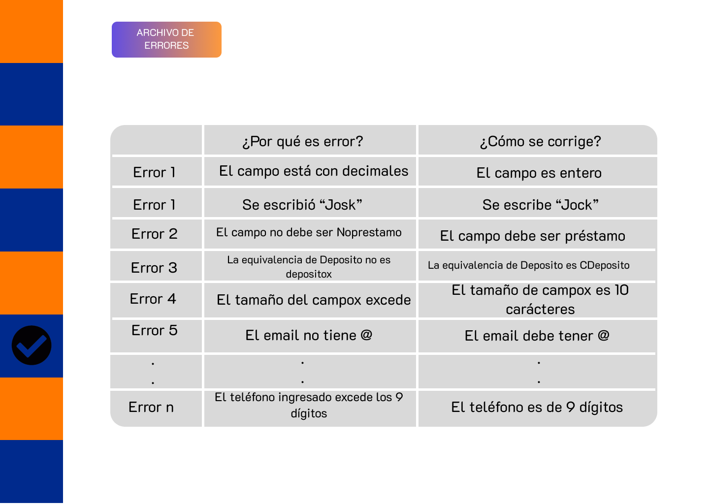

# Sentencias SQL por cada Prototipo

## Gestión de Usuarios

### Visualización de Usuarios

---

**Código Requerimiento:** R-001

**Código Interfaz:** I-001

**Imagen Interfaz**


**Sentencias SQL**

**Eventos:**

1. **Carga de Página:**

    Se llenará la lista de niveles de acceso:
    ```sql
    SELECT nombre_rol
    FROM public."Roles"
    ORDER BY id_rol ASC;
    ```

2. **Botón Generar credenciales:**

    Se agregará un nuevo registro en la tabla Empleado
    ```sql
    DO $$
    DECLARE
        nueva_contraseña VARCHAR(9);
    BEGIN
        nueva_contraseña := substring(md5(random()::text) from 1 for 9);
        INSERT INTO public."Empleado" (nombre, correo, "contraseña", telefono, dni, rol_id)
        VALUES ('<Nombre>', '<correo>@bcp.pe', nueva_contraseña, '<telefono>', '<DNI>', (SELECT id_rol FROM public."Roles" WHERE nombre_rol = '<Rol>'));
    END $$;
    ```

---

### Modificación de Usuarios

**Código Requerimiento:** R-002

**Código Interfaz:** I-002

**Imagen Interfaz**


**Sentencias SQL**

**Eventos:**

1. **Carga de Página:**

    Se llenará la lista de usuarios:
    ```sql
    SELECT e.nombre
    FROM public."Empleado" e
    JOIN public."Roles" r ON e.rol_id = r.id_rol
    WHERE r.nivel_acceso != 'muy alto';

    ```

2. **Generar nueva contraseña:**

    Se cambiará la contraseña por una aleatoria
    ```sql
    DO $$
    DECLARE
        v_nombre VARCHAR(50);
        nueva_contraseña VARCHAR(9);
    BEGIN
        v_nombre := '<nombre_seleccionado>';
        nueva_contraseña := substring(md5(random()::text) from 1 for 9);
        UPDATE public."Empleado"
        SET "contraseña" = nueva_contraseña
        WHERE nombre = v_nombre;
        RAISE NOTICE 'La nueva contraseña para % es %', v_nombre, nueva_contraseña;
    END $$;
    ```

---

**Código Requerimiento:** R-003

**Código Interfaz:** I-003

**Imagen Interfaz**

<div>

</div>

**Sentencias SQL**

**Eventos:**

1. **Carga de Página:**

    Se llenará la lista de usuarios:
    ```sql
    SELECT 
        e.id_empleado AS ID,
        e.dni AS "N° de acceso (DNI)",
        e.nombre AS "Nombre",
        r.nombre_rol AS "Rol",
        e."contraseña" AS "Contraseña",
        e.correo AS "Correo",
        e.telefono AS "Teléfono"
    FROM 
        public."Empleado" e
    JOIN 
        public."Roles" r ON e.rol_id = r.id_rol;
    ```

---

**Código Requerimiento:** R-004

**Código Interfaz:** I-004

**Imagen Interfaz**

<div>

</div>

**Sentencias SQL**

**Eventos:**

1. **Carga de Página:**

    Se llenará la lista de usuarios:
    ```sql
    SELECT 
        e.nombre AS "Empleado",
        r.nombre_rol AS "Rol",
        re.fecha AS "Fecha",
        re.tareas_completadas AS "Tareas Completadas",
        re.tiempo_promedio_tarea AS "Tiempo Promedio por Tarea",
        re.calidad_trabajo AS "Calidad del Trabajo",
        re.participacion_reuniones AS "Participación en Reuniones",
        re.documentos_generados AS "Documentos Generados"
    FROM 
        public."RendimientoEmpleado" re
    INNER JOIN 
        public."Empleado" e ON re.id_empleado = e.id_empleado
    INNER JOIN 
        public."Roles" r ON e.rol_id = r.id_rol
    ORDER BY 
        e.nombre, re.fecha;
    ```

2. **Filtro fecha:**

    Se mostrarán los reportes en el intervalo de fecha establecido:
    ```sql
    SELECT 
        e.nombre AS "Empleado",
        r.nombre_rol AS "Rol",
        re.fecha AS "Fecha",
        re.tareas_completadas AS "Tareas Completadas",
        re.tiempo_promedio_tarea AS "Tiempo Promedio por Tarea",
        re.calidad_trabajo AS "Calidad del Trabajo",
        re.participacion_reuniones AS "Participación en Reuniones",
        re.documentos_generados AS "Documentos Generados"
    FROM 
        public."RendimientoEmpleado" re
    INNER JOIN 
        public."Empleado" e ON re.id_empleado = e.id_empleado
    INNER JOIN 
        public."Roles" r ON e.rol_id = r.id_rol
    WHERE 
        re.fecha BETWEEN '<fecha_inicio>' AND '<fecha_fin>'
    ORDER BY 
        e.nombre, re.fecha;
    ```

3. **Filtro Rol:**

    Se mostrarán los reportes de los empleados con el rol seleccionado:
    ```sql
    SELECT 
        e.nombre AS "Empleado",
        r.nombre_rol AS "Rol",
        re.fecha AS "Fecha",
        re.tareas_completadas AS "Tareas Completadas",
        re.tiempo_promedio_tarea AS "Tiempo Promedio por Tarea",
        re.calidad_trabajo AS "Calidad del Trabajo",
        re.participacion_reuniones AS "Participación en Reuniones",
        re.documentos_generados AS "Documentos Generados"
    FROM 
        public."RendimientoEmpleado" re
    INNER JOIN 
        public."Empleado" e ON re.id_empleado = e.id_empleado
    INNER JOIN 
        public."Roles" r ON e.rol_id = r.id_rol
    WHERE 
        r.nombre_rol = '<rol>'
    ORDER BY 
        e.nombre, re.fecha;
    ```
---
**Código Requerimiento:** R-005

**Código Interfaz:** I-005

**Imagen Interfaz**

<div>

</div>

**Sentencias SQL**

**Eventos:**

1. **Verificación de usuario:**

    Se llenará la tabla:
    ```sql
    SELECT nombre, correo FROM public."Empleado" WHERE dni = '<Número de Acceso>' AND "contraseña" = '<Contraseña>';
    ```

2. **Boton de Inicio de Sesion:** 

    Se mostrarán los reportes en el intervalo de fecha establecido:
    ```sql
    	DO $$
	DECLARE
    	  v_nombre VARCHAR(50);
    	  v_correo VARCHAR(50);
	BEGIN
    	  SELECT nombre, correo INTO v_nombre, v_correo
    	  FROM public."Empleado"
    	  WHERE dni = '<Número de Acceso>'
   	  AND "contraseña" = '<Contraseña>';

   	 IF FOUND THEN
     	  RAISE NOTICE 'Bienvenido %', v_nombre;
        	-- Redirección a la página principal
    	 ELSE
           RAISE NOTICE 'Credenciales incorrectas, por favor intente de nuevo';
    	 END IF;
	END $$;

    ```

---

## Gestión de Pedidos

### Visualización de Pedidos de Migración

---

**Código Requerimiento:** R-010, R-011

**Código Interfaz:** I-010

**Imagen Interfaz**

<div>

</div>

**Sentencias SQL**

**Eventos:**

1. **Carga de Página:**

    Se llenará la primera tabla:
    ```sql
	SELECT 
	    p."Pedido_Id" AS "Pedido",
	    a."Area_Nombre" AS "Área Solicitante",
		s."nombre_squad" AS "Squad Encargardo",
	    e."Estado_Tipo" AS "Estado",
	    pr."Prioridad_Tipo" AS "Prioridad",
	    p."Pedido_Fecha" AS "Fecha del Pedido", 
	    p."Pedido_FechaLimite" AS "Fecha Límite"
	FROM public."Pedido" p
	INNER JOIN public."Area" a ON a."Area_Id" = p."Area_Id"
	INNER JOIN public."Squad" s ON s.id_squad = p."Id_Squad"
	INNER JOIN public."Estado" e ON e."Estado_Id" = p."Estado_Id"
	INNER JOIN public."Prioridad" pr ON p."Prioridad_Id" = p."Prioridad_Id"
	ORDER BY p."Pedido_FechaLimite" DESC
	LIMIT 3;
    ```

    Se llenará la segunda tabla:
    ```sql
	SELECT
	    m."Migracion_Id" AS "Migración",
	    m."Pedido_Id" AS "Pedido",
	    t."nombre_tecnologia" AS "Tecnología Usada",
		a."nombre_ambiente" AS "Entorno",
	    m."Fecha_migracion" AS "Fecha de Migración"
	FROM public."Migracion" m
	INNER JOIN public."Tecnologia" t ON t.id_tecnologia = m."Id_Tecnologia"
	INNER JOIN public."Ambiente" a ON a.id_ambiente = m."AmbienteId"
	ORDER BY m."Fecha_migracion" DESC
	LIMIT 3;
    ```

---

**Código Requerimiento:** R-010

**Código Interfaz:** I-011

**Imagen Interfaz**

<div>

</div>

**Sentencias SQL**

**Eventos:**

1. **Carga de Página:**

    Se llenará la tabla:
    ```sql
	SELECT 
	    p."Pedido_Id" AS "Pedido",
	    a."Area_Nombre" AS "Área Solicitante",
		s."nombre_squad" AS "Squad Encargardo",
	    e."Estado_Tipo" AS "Estado",
	    pr."Prioridad_Tipo" AS "Prioridad",
	    p."Pedido_Fecha" AS "Fecha del Pedido", 
	    p."Pedido_FechaLimite" AS "Fecha Límite"
	FROM public."Pedido" p
	INNER JOIN public."Area" a ON a."Area_Id" = p."Area_Id"
	INNER JOIN public."Squad" s ON s.id_squad = p."Id_Squad"
	INNER JOIN public."Estado" e ON e."Estado_Id" = p."Estado_Id"
	INNER JOIN public."Prioridad" pr ON p."Prioridad_Id" = p."Prioridad_Id"
	ORDER BY p."Pedido_FechaLimite" DESC;
    ```

---

**Código Requerimiento:** R-010

**Código Interfaz:** I-012

**Imagen Interfaz**

<div>

</div>

**Sentencias SQL**

**Eventos:**

1. **Carga de Página:**

    Se llenará la tabla:
    ```sql
	SELECT
		m."Pedido_Id" AS "Pedido",
	    m."Migracion_Id" AS "Migración",
	    t."nombre_tecnologia" AS "Tecnología Usada",
		a."nombre_ambiente" AS "Entorno",
	    m."Fecha_migracion" AS "Fecha de Migración"
	FROM public."Migracion" m
	INNER JOIN public."Tecnologia" t ON t.id_tecnologia = m."Id_Tecnologia"
	INNER JOIN public."Ambiente" a ON a.id_ambiente = m."AmbienteId"
	ORDER BY m."Fecha_migracion" DESC;
    ```

    Se llenará la lista de pedidos a seleccionar:
    ```sql
    SELECT "Pedido_Id"
    FROM public."Pedido";
    ```

2. **Botón Buscar:**
    Cuando el usuario presione el botón buscar se filtrará la tabla por el pedido seleccionado:
    ```sql
	SELECT
		m."Pedido_Id" AS "Pedido",
	    m."Migracion_Id" AS "Migración",
	    t."nombre_tecnologia" AS "Tecnología Usada",
		a."nombre_ambiente" AS "Entorno",
	    m."Fecha_migracion" AS "Fecha de Migración"
	FROM public."Migracion" m
	INNER JOIN public."Tecnologia" t ON t.id_tecnologia = m."Id_Tecnologia"
	INNER JOIN public."Ambiente" a ON a.id_ambiente = m."AmbienteId"
	WHERE m."Pedido_Id" = <1>
	ORDER BY m."Fecha_migracion" DESC;
    ```

    Donde `<1>` corresponde al código de pedido seleccionado.


### Adición de Pedidos y de Migraciones

---

**Código Requerimiento:** R-012

**Código Interfaz:** I-013

**Imagen Interfaz**

<div>

</div>

**Sentencias SQL**

**Eventos:**

1. **Cargar Página:**

    Se llenará la lista de áreas a seleccionar:
    ```sql
    SELECT "Area_Id", "Area_Nombre" 
    FROM public."Area";
    ```
    Se llenará la lista de squads a seleccionar:
    ```sql
    SELECT "id_squad", "nombre_squad" 
    FROM public."Squad";
    ```
    
    Se llenará la lista de estados a seleccionar:
    ```sql
    SELECT "Estado_Id", "Estado_Tipo"
    FROM public."Estado";
    ```

    Se llenará la lista de prioridad a seleccionar:
    ```sql
    SELECT "Prioridad_Id", "Prioridad_Tipo" 
    FROM public."Prioridad";
    ```

1. **Botón Agregar:**
    Se agregará un nuevo registro a la tabla de pedidos.
    ```sql
    INSERT INTO public."Pedido"( "Area_Id", "Id_Squad", "Prioridad_Id", "Estado_Id", "Pedido_Fecha", "Pedido_FechaLimite")
        VALUES 
        (<1>, <2>, <3>, <4>, <5>, CURRENT_DATE);
    ```
    Donde `<1>` corresponde al código de área seleccionado.

    Donde `<2>` corresponde al código del squad seleccionado.
   
    Donde `<3>` corresponde al código de estado seleccionado.

    Donde `<4>` corresponde al código de prioridad seleccionado.

    Donde `<5>` se capturarán de la interfaz de usuario.

---

**Código Requerimiento:** R-013

**Código Interfaz:** I-014

**Imagen Interfaz**

<div>

</div>

**Sentencias SQL**

**Eventos:**

1. **Cargar Página:**

    Se llenará la lista de pedidos a seleccionar:
    ```sql
    SELECT "Pedido_Id"
    FROM public."Pedido";
    ```

    Se llenará la lista de squads a seleccionar:
    ```sql
    SELECT id_ambiente, nombre_ambiente 
    FROM public."Ambiente";
    ```

    Se llenará la lista de tecnologías a seleccionar:
    ```sql
    SELECT id_tecnologia, nombre_tecnologia 
    FROM public."Tecnologia";
    ```

2. **Botón Agregar:**

    Se agregará un nuevo registro a la tabla de pedidos.
    ```sql
    INSERT INTO public."Migracion"(
        "Pedido_Id", "AmbienteId", "Id_Tecnologia", "Fecha_migracion", "Valido", "Ultimo")
        VALUES (<1>, <2>, <3>, <4>, CURRENT_DATE, true, true);
    ```
    Donde `<1>` corresponde al código de pedido seleccionado.

    Donde `<2>` corresponde al código del ambiente seleccionado.

    Donde `<3>` corresponde al código de tecnología seleccionado.

    Donde `<4>` se capturarán de la interfaz de usuario.

## Gestión de Reuniones

### Creación de Reunión

---

**Código Requerimiento:** R-020 

**Código Interfaz:** I-020

**Imagen Interfaz**

<div>

</div>

**Sentencias SQL**

**Eventos:**

1. **Carga de Página:**

* Se ingresan los detalles de la reunión :
  
    ```sql
	INSERT INTO public."Reunion" ("Id_Empleado", "Pedido_Id", "TipoReunion_Id", "HoraInicio", "HoraFin", "Plataforma", "Fecha", "Estado", "Agenda", "FechaProgramacion", "HoraProgramacion") VALUES
	(<1>, <2>, <3>, <4>, <5>, <6>, <7>, 'pendiente', <8>, CURRENT_DATE, CURRENT_TIME);

    ```
	Donde:

	`<1>`: Corresponde al ID del empleado que organiza la reunión.
	
 	`<2>`: Corresponde al ID del pedido asociado a la reunión.

	`<3>`: Corresponde al ID del tipo de reunión.

	`<4>`: Corresponde a la hora de inicio de la reunión.

	`<5>`: Corresponde a la hora de finalización de la reunión.

	`<6>`: Corresponde a la plataforma en la que se llevará a cabo la reunión.

	`<7>`: Corresponde a la fecha programada para la reunion.

	`<8>`: Corresponde a la agenda de la Reunión.

* Se cargan a los participantes:
  	```sql
  
	    SELECT "Participante_Id"
		FROM public."Participante"
		WHERE "Area_Id" = (SELECT p."Area_Id" 
		FROM public."Pedido" p
		INNER JOIN public."Reunion" r ON p."Pedido_Id" = r."Pedido_Id"
		WHERE r."Reunion_Id" = <1>); 
   ``` 
	
 	Donde `<1>` corresponde al Id de la Reunión.

 * Se seleccionan a las personas que participarán:
 
	```sql
    INSERT INTO public."Participa_en"("Reunion_Id", "Participante_Id")
	VALUES
	    (<1>, <2>),
	    (<1>, <3>),
	    (<1>, <4>)
		...;
	```
	Donde :

	`<1>` corresponde al Id de la Reunión.

	`<2>`, `<3>`, `<4>` corresponde al Id de los Participantes


2.**Creación del Reporte de conformidad y su asociación con la reunion**

* Si se trata de la primera reunión de un pedido, se crea el reporte de conformidad correspondiente y con estado “Pendiente”.

	 ```sql
	    INSERT INTO public."Reporte_Conformidad" ("Pedido_Id", "Tipo_Reporte", "Fecha", "Estado")
	VALUES ((SELECT "Pedido_Id" 
			FROM public."Reunion"
			WHERE "Reunion_Id" = <1>),
			(SELECT tr."Nombre" 
			FROM public."Reunion" r
			INNER JOIN public."Tipo_Reunion" tr ON r."TipoReunion_Id" = tr."TipoReunion_Id"
			WHERE r."Reunion_Id" = <1>), 
			CURRENT_DATE, 
			'pendiente');

    ```
	Donde `<1>` corresponde al Id de la Reunión

* Se asocia la reunión a su reporte de conformidad correspondiente.
* En caso sea no sea la primera reunión creada a un pedido, solo se asocia al reporte de conformidad ya creado y no se crea un nuevo registro en la tabla Reporte conformidad, para verificar esa condición, utilizamos esta consulta:

```sql
	    SELECT COUNT(*) > 0 
FROM public."Reporte_Conformidad" rc 
WHERE rc."Pedido_Id" = (
    SELECT "Pedido_Id" 
    FROM public."Reunion" 
    WHERE "Reunion_Id" = <1>
) 
AND rc."Tipo_Reporte" = (
    SELECT tr."Nombre" 
    FROM public."Reunion" r 
    INNER JOIN public."Tipo_Reunion" tr ON r."TipoReunion_Id" = tr."TipoReunion_Id" 
    WHERE r."Reunion_Id" = <1>
);

```
Lo usamos a manera de booleano para verificar si existe algun reporte de conformidad creado para un pedido para sino simplemente asociarlo.
   
* Si la reunión es de tipo de “Entrada”:
	```sql
	    INSERT INTO public."Reunion_Reporte_Conformidad" ("Reunion_Id", "Reporte_Id")
	VALUES (<1>,
			(SELECT MIN("Reporte_Id")
			 FROM public."Reporte_Conformidad" 
			 WHERE "Pedido_Id" = (SELECT "Pedido_Id" 
			FROM public."Reunion"
			WHERE "Reunion_Id" = <1>)))

    ``` 
	Donde `<1>` corresponde al Id de la Reunión

* Si la reunión es de tipo de "Salida":

	```sql
	    INSERT INTO public."Reunion_Reporte_Conformidad" ("Reunion_Id", "Reporte_Id")
	VALUES (<1>,
			(SELECT MAX("Reporte_Id")
			 FROM public."Reporte_Conformidad" 
			 WHERE "Pedido_Id" = (SELECT "Pedido_Id" 
			FROM public."Reunion"
			WHERE "Reunion_Id" = <1>)))

    ```
	Donde `<1>` corresponde al Id de la Reunión


### Listado de reuniones completadas y pendientes

---

**Código Requerimiento:** R-021 

**Código Interfaz:** I-021

**Imagen Interfaz**

<div>

</div>

**Sentencias SQL**

**Eventos:**

1. **Carga de Página:**

* Mostrando la sección de Reuniones Completadas

	```sql
    SELECT 'R'|| r."Reunion_Id" as "Reunión",
	tr."Nombre" as "Tipo", r."Fecha",
	r."HoraInicio" as "Inicio",
	r."HoraFin" as "Fin",
	r."Pedido_Id"
	FROM public."Reunion" r
	INNER JOIN public."Tipo_Reunion" tr ON r."TipoReunion_Id" = tr."TipoReunion_Id"
	WHERE "Estado" = 'completada'
	ORDER BY "Fecha" DESC, "HoraInicio" DESC;

    ```
* Mostrando la sección de Reuniones Pendientes:

	```sql
    SELECT 'R'|| r."Reunion_Id" as "Reunión",
	tr."Nombre" as "Tipo", r."Fecha",
	r."HoraInicio" as "Inicio", 
	r."HoraFin" as "Fin", 
	r."Pedido_Id"
	FROM public."Reunion" r
	INNER JOIN public."Tipo_Reunion" tr ON r."TipoReunion_Id" = tr."TipoReunion_Id"
	WHERE "Estado" = 'pendiente'
	ORDER BY "Fecha" ASC, "HoraInicio" ASC;

    ```
2. **Filtro - búsqueda**

* Se permitirá buscar las reuniones completadas y pendientes por el pedido seleccionado a buscar

	```sql
	    SELECT r."Reunion_Id", 
       tr."Nombre" AS "Tipo", 
       r."Fecha", 
       r."HoraInicio" AS "Inicio", 
       r."HoraFin" AS "Fin", 
       r."Pedido_Id"
	FROM public."Reunion" r
	INNER JOIN public."Tipo_Reunion" tr ON r."TipoReunion_Id" = tr."TipoReunion_Id"
	WHERE r."Pedido_Id" = <1>
	  AND r."Estado" = '<2>' 
	ORDER BY r."Fecha" DESC, r."HoraInicio" DESC;

    ```
	Donde
  	`<1>` es el id del pedido
  	`<2>` es 'pendiente' o 'completada'

3. **Mostrar la lista ordenada**

* Al presionar el botón de ordenar
	```sql
	    SELECT 'R'|| r."Reunion_Id" as "Reunión",
		tr."Nombre" as "Tipo",
		r."Fecha",
		r."HoraInicio" as "Inicio",
		r."Horafin" as "Fin",
		r."Pedido_Id"
	FROM public."Reunion" r
	INNER JOIN public."Tipo_Reunion" tr ON r."TipoReunion_Id" = tr."TipoReunion_Id"
	WHERE "Estado" = '<1>'
	ORDER BY "Fecha" <2>, "HoraInicio" <2>;

    ```
	Donde

 	`<1>` corresponde al Estado de la reunión de donde se presiona el botón.
  
	`<2>`  se refiere a ASC o DESC

4. **Botón Ver Detalles**
   
* Te redirige a la pantalla Mostrar Detalles.

6. **Botón Ver reportes de Conformidad**
   
* Te redirige a la pantalla Ver reportes de Conformidad.


### Detalles de Reunión Pendiente

---

**Código Requerimiento:** R-022

**Código Interfaz:** I-022

**Imagen Interfaz**

<div>

</div>

**Sentencias SQL**

**Eventos:**

1. **Carga de Página:**

* Se muestra la información de la reunión pendiente seleccionada:

	```sql
	    SELECT 'R'|| r."Reunion_Id" as "Reunión", 
			tr."Nombre" as "Tipo", 
			r."Fecha", 
			r."HoraInicio" as "Inicio", 
			r."HoraFin" as "Fin",
	    	("Horafin"::time - "HoraInicio"::time) AS "Duración",
			r."Plataforma",
			r."Agenda"
	FROM public."Reunion" r
	INNER JOIN public."Tipo_Reunion" tr ON r."TipoReunion_Id" = tr."TipoReunion_Id"
	WHERE 
	    "Reunion_Id" = <1> AND "Estado" = 'pendiente';

    ```
	Donde `<1>` corresponde al Id de la Reunión

2. **Marcar reunión como Completada**

* Se actualiza el estado de la reunión pendiente a completada
	```sql
	    UPDATE public."Reunion"
	SET 
	    "Estado" = 'completada'
	WHERE "Reunion_Id" = <1>;

    ```
	Donde `<1>` corresponde al Id de la Reunión


5. **Botón Cancelar Reunión**
   
	* Te redirige a la pantalla de Cancelar Reunión

### Cancelar Reunión Programada

---

**Código Requerimiento:** R-024

**Código Interfaz:** I-024

**Imagen Interfaz**

<div>

</div>

**Sentencias SQL**

**Eventos:**

1. **Cancelar Reunión**

* Primero se elimina la asociación con el reporte de conformidad:
     ```sql
		DELETE FROM public."Reunion_Reporte_Conformidad"
	WHERE "Reunion_Id" = <1>;

    ```
	Donde `<1>` corresponde al Id de la Reunión.

* Luego se eliminan las asociaciones de los participantes seleccionados anteriormente para esa reunion
  
    ```sql
		DELETE FROM public."Participa_en"
	WHERE "Reunion_Id" = <1>;

    ```
	Donde `<1>` corresponde al Id de la Reunión.
* Finalmente se elimina el registro de la reunion
  
    ```sql
		DELETE FROM public."Reunion"
	WHERE "Reunion_Id" = <1> AND "Estado" = 'pendiente';

    ```
	Donde `<1>` corresponde al Id de la Reunión.


### Detalles de Reunión Completada

---

**Código Requerimiento:** R-023

**Código Interfaz:** I-023

**Imagen Interfaz**

<div>

</div>

**Sentencias SQL**

**Eventos:**

1. **Carga de la página**

* Mostrando información referente a la reunión completada seleccionada.

	```sql
		SELECT 'R'|| r."Reunion_Id" as "Reunión", 
			tr."Nombre" as "Tipo", 
			r."Fecha", 
			r."HoraInicio" as "Inicio", 
			r."HoraFin" as "Fin",
	    	("HoraFin"::time - "HoraInicio"::time) AS "Duración",
			r."Plataforma",
			r."Agenda",
			r."Acuerdos"
	FROM public."Reunion" r
	INNER JOIN public."Tipo_Reunion" tr ON r."TipoReunion_Id" = tr."TipoReunion_Id"
	WHERE r."Reunion_Id" = <1> AND r."Estado" = 'completada';

    ```
	Donde `<1>` corresponde al Id de la Reunión.


2. **Agregar/Editar Acuerdos**

	```sql
	    UPDATE public."Reunion"
	SET "Acuerdos" = '<2>'
	WHERE "Reunion_Id" = <1> AND "Estado" = 'completada';

    ```
	Donde

	`<1>` corresponde al Id de la Reunión.

	`<2>` corresponde a los acuerdos agregados/modificados.


3. **Generar Reporte de conformidad**

* Este botón actualiza el estado del Reporte de Conformidad creado con la primera reunión asociada al mismo pedido, pasándolo de “pendiente” a “completado”.

	```sql
	    UPDATE public."Reporte_Conformidad"
	SET "Estado" = 'completado',
	"Fecha" = CURRENT_DATE
	WHERE "Reporte_Id" = (
		SELECT "Reporte_Id"
		FROM public."Reunion_Reporte_Conformidad"
		WHERE "Reunion_Id" =<1>) ;

    ```
	Donde `<1>` corresponde al Id de la Reunión.


### Generar reporte de conformidad

---

**Código Requerimiento:** R-025

**Código Interfaz:** I-025

**Imagen Interfaz**

<div>

</div>

**Sentencias SQL**

**Eventos:**

1. **Carga de la página**

* Mostrando la vista previa del reporte, con todos los datos relevantes de las reuniones asociadas.

	```sql
		SELECT r."Reunion_Id",rrc."Reporte_Id", r."HoraInicio",r."HoraFin", r."Agenda", r."Acuerdos"
	FROM public."Reunion_Reporte_Conformidad" rrc
	JOIN public."Reunion" r ON rrc."Reunion_Id" = r."Reunion_Id"
	JOIN public."Reporte_Conformidad" rc ON rrc."Reporte_Id" = rc."Reporte_Id"
	WHERE  r."Pedido_Id"= ( 
			SELECT "Pedido_Id"
			FROM public."Reunion"
			WHERE "Reunion_Id"= <1>) AND
		r."TipoReunion_Id"=
			(SELECT tr."TipoReunion_Id" 
			FROM public."Reunion" r
			INNER JOIN public."Tipo_Reunion" tr ON r."TipoReunion_Id" = tr."TipoReunion_Id"
			WHERE r."Reunion_Id" = <1>)	AND 
			rc."Estado" = 'completado'

    ```
	Donde `<1>` corresponde al Id de la Reunión.

### Listado de Reuniones de conformidad

---

**Código Requerimiento:** R-026

**Código Interfaz:** I-026

**Imagen Interfaz**

<div>

</div>

**Sentencias SQL**
1. Se carla la página:

Se muestran los 4 últimos pedidos y sus respectivos reportes de conformidad:

   * Se obtienen los 4 últimos pedidos
     
     ```sql
	    SELECT "Pedido_Id"
	FROM public."Pedido"
	ORDER BY "Pedido_Id" DESC
	LIMIT 4;
    ```
* Luego se obtienen los reportes de conformidad por pedido:
* Con esta consulta también se permitirá filtrar/buscar a las reuniones por pedido.

 ```sql
	   SELECT "Reporte_Id", 
       "Tipo_Reporte", 
       "Fecha", 
       "Estado"
FROM public."Reporte_Conformidad"
WHERE "Pedido_Id" = <1>;

 ```
Donde ´<1>´ corresponde al Id del pedido

2. Ver Detalles
* Se podrán ver los detalles de cada reporte de conformidad generado.
  
   ```sql
	   SELECT r."Reunion_Id", 
       rc."Tipo_Reporte", 
       r."Fecha", 
       r."HoraInicio", 
       r."HoraFin", 
       r."Acuerdos", 
       rc."Pedido_Id"
	FROM public."Reunion_Reporte_Conformidad" rrc
	JOIN public."Reunion" r ON rrc."Reunion_Id" = r."Reunion_Id"
	JOIN public."Reporte_Conformidad" rc ON rrc."Reporte_Id" = rc."Reporte_Id"
	WHERE rc."Reporte_Id" = <1>

  ```
Donde ´<1>´ corresponde al Id del reporte de conformidad


## Equivalencias y Modelo DDV

### Visualización de Progreso y Reporte de Tareas

---

**Código Requerimiento:** R-030

**Código Interfaz:** I-030

**Imagen Interfaz**

<div>

</div>

**Sentencias SQL**

**Eventos:**

1. **Carga de Página:**
   Se llenará la lista de estados a seleccionar
   SELECT "Estado_Tipo" FROM "Estado";

   Se mostrará la tabla de progreso:
   
   ```sql
   SELECT t."descripcion" AS Sección,
    es."Estado_Tipo" AS Estado,
    e."nombre" AS Responsable
	FROM public."Tarea" t
	INNER JOIN public."Estado" es ON t.estadoId = es."Estado_Id"
	INNER JOIN public."Migracion" m ON t.id_migracion = m."Migracion_Id"
	INNER JOIN public."Empleado" e ON t.id_empleado = e.id_empleado
	WHERE t."id_migracion" = 1
	AND (t."descripcion" = 'Agregar Concepto de Negocio' 
		 OR t."descripcion" = 'Agregar Equivalencia' 
		 OR t."descripcion" = 'Insertar Modelo DDV');
   ```

2. **Seleccionar Nuevo Estado:**
   
   ```sql
   UPDATE public."Tarea"
   SET estadoId = (
    SELECT "Estado_Id" 
    FROM public."Estado" 
    WHERE "Estado_Tipo" = <1>
	) WHERE id_tarea = '<2>';
   ```
	Donde `<1>` corresponde al estado seleccionado
	Donde `<2>`se capturará de la interfaz de usuario

---
**Código Requerimiento:** R-031

**Código Interfaz:** I-031

**Imagen Interfaz**

<div>

</div>

**Sentencias SQL**

**Eventos:**

1. **Carga de Página:**
   
   Se llenará la tabla de reporte de tarea:
   
   ```sql
   SELECT 
    t.descripcion AS "Tarea",
    t.fecha_fin AS "Fecha Asignada",
    t.fecha_inicio AS "Fecha Inicio",
    t.fecha_fin_real AS "Fecha Fin",
    AGE(t.fecha_fin_real, t.fecha_inicio) AS "Tiempo Demorado"
	FROM public."Tarea" t
	WHERE t.id_migracion = 1
	AND (t."descripcion" = 'Agregar Concepto de Negocio' 
		 OR t."descripcion" = 'Agregar Equivalencia' 
		 OR t."descripcion" = 'Insertar Modelo DDV');
   ```
   
   Se llenará la tabla de evaluación:

   ```sql
   SELECT t.descripcion AS "Tarea",
	CASE 
	WHEN t.fecha_fin_real IS NULL AND CURRENT_DATE > t.fecha_fin THEN 'retrasada'
	WHEN t.fecha_fin_real IS NOT NULL AND t.fecha_fin_real <= t.fecha_fin THEN 'a tiempo'
	ELSE 'retrasada'
	END AS evaluacion
   FROM public."Tarea" t
   WHERE t.id_migracion = 1
   AND (t."descripcion" = 'Agregar Concepto de Negocio' 
	OR t."descripcion" = 'Agregar Equivalencia' 
	OR t."descripcion" = 'Insertar Modelo DDV');
   ```

---

### Conceptos de Negocio

---

**Código Requerimiento:** R-032

**Código Interfaz:** I-032

**Imagen Interfaz**

<div>

</div>

**Sentencias SQL**

**Eventos:**

1. **Carga de Página:**

    Se llenará la tabla:
    ```sql
    SELECT 
	d."tipo_dominio" AS dominio,
	s."nombre_subdominio" AS subdominio,
	e."nombre_esquema" AS esquema,
	dt."Tabla" AS tabla,
	dt."Campo" AS campo,
	cn."DefinicionTabla",
	cn."DefinicionCampo"
	FROM public."ConceptosNegocio" cn
	INNER JOIN public."Subdominio" s ON cn."id_subdominio" = s."id_subdominio"
	INNER JOIN public."Dominio" d ON s."id_dominio" = d."id_dominio"
	INNER JOIN public."DefinicionesTecnicas" dt ON cn."id_referencia" = dt."id_DT"
	INNER JOIN public."Esquema" e ON dt."EsquemaId" = e."id_esquema";
    ```
---

**Código Requerimiento:** R-033

**Código Interfaz:** I-033

**Imagen Interfaz**

<div>

</div>

**Sentencias SQL**

**Eventos:**

1. **Carga de Página:**
   
    Se llenará la lista de dominios a seleccionar:
    ```sql
    SELECT id_dominio, tipo_dominio
    FROM public.”Dominio”;
    ```
   Se llenará la lista de subdominios a seleccionar, basándonos en el dominio seleccionado:
    ```sql
    SELECT id_subdominio, nombre_subdominio
    FROM public."Subdominio"
    WHERE "id_dominio" = <1>;
    ```
    Donde `<1>` corresponde al código del dominio seleccionado previamente
    Se llenará la lista de ambientes a seleccionar:
   ```sql
    SELECT id_ambiente, nombre_ambiente 
    FROM public."Ambiente";
    ```
    Obtener la lista desplegable de esquemas posibles, basándonos en el ambiente seleccionado:
   ```sql
    SELECT id_esquema, nombre_esquema
    FROM public."Esquema"
    WHERE "AmbienteId" =  <2>;
   ```
    Donde `<2>` corresponde al código de ambiente seleccionado previamente

2. **Botón: Guardar**

   Se guardarán nuevos registro tanto en la tabla de definiciones técnicas como en conceptos de negocio:
   
```sql
    -- Insertar el campo en Definiciones Tecnicas
    INSERT INTO public."DefinicionesTecnicas" ("EquivalenciaId", "EsquemaId", "Tabla", 
    "Campo")
    VALUES (NULL, <1>, NULL, <2>)

    -- Insertar el nombre equivalente del campo en DefinicionesTecnicas
    INSERT INTO public."DefinicionesTecnicas" ("EquivalenciaId", "EsquemaId", "Tabla", 
    "Campo")
    VALUES (1, 7, NULL, <5>);

    -- Insertar en Definicion del Campo en ConceptosNegocio 
    INSERT INTO public."ConceptosNegocio" ("id_subdominio", "id_referencia", 
    "DefinicionTabla", "DefinicionCampo", "MigracionId")
    VALUES (<3>, 1, NULL, <4> , 1);

```
	Donde `<1>` corresponde al código del esquema seleccionado

  	Donde `<2>` se capturará de la interfaz de usuario.

   	Donde `<3>` corresponde al código del subdominio seleccionado.

	Donde `<4>` se capturará de la interfaz de usuario.

	Donde `<5>` se capturará de la interfaz de usuario.
 
---

**Código Requerimiento:** R-034

**Código Interfaz:** I-034

**Imagen Interfaz**

<div>

</div>

**Sentencias SQL**

**Eventos:**

1. **Carga de Página:**

   ```sql
    SELECT "Campo" FROM "DefinicionesTecnicas"
	WHERE "EquivalenciaId" IS NULL
	AND "Tabla" IS NULL;
   ```

2. **Botón Asociar:**

    Se actualizará la tabla de Definiciones Técnicas con el registro “Tabla” asociado al 
    campo previamente registrado:
   
    ```sql
    UPDATE public."DefinicionesTecnicas"
    SET "Tabla" = '<1>' 
    WHERE "id_DT" = (SELECT "id_DT"
    FROM public."DefinicionesTecnicas"
    WHERE "Campo" = '<2>');
   ```
   Donde `<1>` se capturará de la interfaz de usuario

   Se actualizará la tabla Conceptos de Negocio con el registro de “Definición Tabla” :

     ```sql
    UPDATE public."ConceptosNegocio" 
    SET "DefinicionTabla" = '<3>'
    WHERE "id_referencia" = (
        SELECT "id_DT" 
        FROM public."DefinicionesTecnicas"
        WHERE "EquivalenciaId" IS NULL
     	AND "Campo" = '<2>'
  	);
   ```
   Donde `<3>` se capturará de la interfaz de usuario.

3. **Botón Agregar Equivalencia:**
   Se actualizará la tabla Definiciones Tecnicas con el registro de “Tabla” :
   
   ```sql
   UPDATE public."DefinicionesTecnicas"
    SET "Tabla" = '<5>' 
    WHERE "EquivalenciaId" = (SELECT "id_DT"
    FROM public."DefinicionesTecnicas"
    WHERE "Campo" = '<2>');
     ```
    Donde `<5>` se capturará de la interfaz de usuario.

    Donde `<2>` es el valor del campo seleccionado.

### Equivalencias

---

**Código Requerimiento:** R-035

**Código Interfaz:** I-035

**Imagen Interfaz**

<div>

</div>

**Sentencias SQL**

**Eventos:**

1. **Carga de Página:**

   Se llenará la lista de tablas a seleccionar:

    ```sql
    SELECT DISTINCT "Tabla"
    FROM public."DefinicionesTecnicas"
    WHERE "EquivalenciaId" IS NULL;
   ```

2. **Botón Buscar:**

   Se llenará las tablas de esquema, tabla y campo.
   ```sql
   SELECT DISTINCT e1.nombre_esquema AS "Esquema Original",
    e2.nombre_esquema AS "Esquema Equivalente"
    FROM public."DefinicionesTecnicas" dt1
    LEFT JOIN public."DefinicionesTecnicas" dt2 ON  dt1."id_DT" = dt2."EquivalenciaId"
    LEFT JOIN public."Esquema" e1 ON dt1."EsquemaId" = e1."id_esquema"
    LEFT JOIN public."Esquema" e2 ON dt2."EsquemaId" = e2."id_esquema"
    WHERE dt1."Tabla" = '<1>';
   ```

   ```sql
   SELECT DISTINCT
       dt1."Tabla" as "Tabla Original",
       dt2."Tabla" as "Tabla Equivalente"
    FROM public."DefinicionesTecnicas" dt1
    LEFT JOIN public."DefinicionesTecnicas" dt2 ON dt1."id_DT" = dt2."EquivalenciaId"
    WHERE dt1."Tabla" = '<1>';
   ```

   ```sql
   SELECT
       dt1."Campo" as "Campo Original",
       dt2."Campo" as "Campo Equivalente"
    FROM public."DefinicionesTecnicas" dt1
    LEFT JOIN public."DefinicionesTecnicas" dt2 ON dt1."id_DT" = dt2."EquivalenciaId"
    WHERE dt1."Tabla" = '<1>';
    ```

    Donde `<1>` se capturará de la interfaz de usuario.

### Modelo DDV

---

**Código Requerimiento:** R-036

**Código Interfaz:** I-036

**Imagen Interfaz**

<div>

</div>

**Sentencias SQL**

**Eventos:**

1. **Botón Buscar:**
    ```sql
   	SELECT 
    dt."Campo" AS "Campo",
    m."EsquemaDDV",
    m."TablaDDV",
    m."CampoDDV",
    m."CampoLlave",
    m."Campo_Descarta"
	FROM public."Modelado" m
	INNER JOIN public."DefinicionesTecnicas" dt
	ON m."id_referencia" = dt."id_DT"
	WHERE dt."Campo" = '<1>';
    ```
     
Donde `<1>` se capturará de la interfaz de usuario.

---

**Código Requerimiento:** R-037

**Código Interfaz:** I-037

**Imagen Interfaz**

<div>

</div>

**Sentencias SQL**

**Eventos:**

1. **Carga de Página:**
   ```sql
   SELECT "Campo" FROM public."DefinicionesTecnicas"
   WHERE  "EquivalenciaId" IS NOT NULL;
    ```
2. **Botón Guardar:**
    ```sql
   INSERT INTO public."Modelado" ("id_referencia", "EsquemaDDV", "TablaDDV", "CampoDDV", 	"CampoLlave", "Campo_Descarta")
	SELECT "id_DT", NULL, NULL, '<1>', <2>, <3> 
	FROM public."DefinicionesTecnicas"
	WHERE "Campo" = '<4>';
 	```
	Donde `<1>` se capturará de la interfaz de usuario.

	Donde `<2>` se capturará de la interfaz de usuario.

	Donde `<3>` se capturará de la interfaz de usuario.

  	Donde `<4>` es el campo seleccionado

3. **Botón Asociar:**

```sql
UPDATE public."Modelado"
SET "EsquemaDDV" = 'EsquemaDDV1',"TablaDDV" = 'TablaDDV1'
WHERE "id_referencia" = (SELECT "id_DT" FROM public."DefinicionesTecnicas"
						WHERE "Campo" = <4> )
```

Donde `<4>` se capturará de la interfaz de usuario.

---

**Código Requerimiento:** R-040

**Código Interfaz:** I-040

**Imagen Interfaz**

<div>

</div>

**Sentencias SQL**

**Eventos:**

1. **Carga de Página:**

   Se llena el pedido con la lista de los pedidos posibles

    ```sql
    SELECT "Pedido_Id" FROM "Pedido"
   ```

2. **Botón Ver Requerimientos:**

   Mostrará los Requerimientos que se usarán para hacer el Universo

   ```sql
    SELECT "Acuerdos" FROM "Reunion" R
    WHERE R."Pedido_Id"=<1>;
   ```
3. **Botón Confirmar y Guardar:**

   Guardará la lógica del universo junto con más detalles

   ```sql
    INSERT INTO "Universo"
    ("Pedido_Id","Codigo","Fecha_Creacion","Tipo")
    VALUES(<1>,<2>,CURRENT_DATE,<3>)
   ```
    Donde `<1>` Del Pedido Seleccionado
    `<2>` Del código escrito
    `<3>` Del tipo elegido
---
**Código Requerimiento:** R-041

**Código Interfaz:** I-041

**Imagen Interfaz**

<div>

</div>

**Sentencias SQL**

**Eventos:**

1. **Carga de Página:**

   Se llena la lista de tecnologías con las disponibles y permitidas para la elaboración de la logica funcional

    ```sql
    SELECT "nombre_tecnologia" FROM "Tecnologia"
    WHERE "nombre_tecnologia"='pl/SQL' 
    OR "nombre_tecnologia"='Pseudocodigo'
    OR "nombre_tecnologia"='Pyspark'
   ```
   Se llena el pedido con la lista de los pedidos posibles

    ```sql
    SELECT "Pedido_Id" FROM "Pedido"
   ```
    Se muestran las migraciones disponibles para el pedido elegido

    ```sql
    SELECT "Migracion_Id" FROM "Migracion" mg
    WHERE mg."Pedido_Id" = <2>
   ```
2. **Botón Ver Universo:**

   Mostrará el universo sobre el cual se elabora la regla de carga funcional

   ```sql
    SELECT "Codigo" FROM "Universo" U
    WHERE  U."Pedido_Id"=<2>

   ```
3. **Botón Campos Equivalentes:**

   Muestra los campos equivalentes hallados en anteriormente, para la elaboración de la regla de carga

   ```sql
    SELECT "Campo" FROM
    ("Modelado" modl INNER JOIN "DefinicionesTecnicas" deft 
    ON modl."ID_Modelo"=deft."ModeloId" INNER JOIN "ConceptosNegocio" cneg 
    ON cneg."id_referencia" = deft."id_DT") WHERE cneg."PedidoId"=<2>
   ```
4. **Botón Campos DDV:**

   Muestra los campos DDV modelados, para la elaboración de la regla de carga

   ```sql
    SELECT "CampoDDV" FROM
    ("Modelado" modl INNER JOIN "DefinicionesTecnicas" deft 
    ON modl."ID_Modelo"=deft."ModeloId" INNER JOIN "ConceptosNegocio" cneg 
    ON cneg."id_referencia" = deft."id_DT") WHERE cneg."PedidoId"=<2>
   ```
5. **Botón Enviar y Terminar:**

   Termina la elaboración de la logica funcional, y la guarda

   ```sql
    INSERT INTO "ReglaDeCargaFuncional"("id_migracion","id_tecnologia","Logica","Fecha")
    VALUES(<3>,<1>,<4>,CURRENT_DATE)
   ```

    Donde `<1>` De la Tecnología Elegida
    `<2>` Del Pedido Seleccionado
    `<3>` De la Migración Elegida
    `<4>` Del Codigo Escrito
---
**Código Requerimiento:** R-043 R-044

**Código Interfaz:** I-042

**Imagen Interfaz**

<div>

</div>

**Sentencias SQL**

**Eventos:**

1. **Carga de Página:**

   Se llena la lista de tecnologías con las disponibles y permitidas para la elaboración de la logica funcional

    ```sql
    SELECT "nombre_tecnologia" FROM "Tecnologia"
    WHERE "nombre_tecnologia"='pl/SQL' 
    OR "nombre_tecnologia"='Pyspark'
   ```
   Se llena el pedido con la lista de los pedidos posibles

    ```sql
    SELECT "Pedido_Id" FROM "Pedido"
   ```
    Se muestran las migraciones disponibles para el pedido elegido

    ```sql
    SELECT "Migracion_Id" FROM "Migracion" mg
    WHERE mg."Pedido_Id" = <2>
   ```
2. **Botón Ver Funcional:**

   Muestra la regla funcional asociada

   ```sql
    SELECT "Logica" FROM "ReglaDeCargaFuncional" rfun
    WHERE rfun."id_migracion"=<3>
   ```
3. **Botón Confirmar y Guardar:**

   Debido a la retroalimentación que se produce, será un insert la primera vez que se cree la regla de carga técnica, luego serán updates al mismo campo

   ```sql
    DO $$
    BEGIN
    IF NOT EXISTS (
        SELECT 1
        FROM "ReglaDeCargaTecnica"
		WHERE "regla_funcional"= (SELECT "ID_ReglaCargaFunc" FROM "ReglaDeCargaFuncional" rfun
								  WHERE  rfun."id_migracion"=<3>)) 
	THEN
        INSERT INTO "ReglaDeCargaTecnica"("regla_funcional","Codigo","Finalizado","Fecha")
		VALUES((SELECT "ID_ReglaCargaFunc" FROM "ReglaDeCargaFuncional" rfun
				WHERE  rfun."id_migracion"=<3>),<4>,false,CURRENT_DATE)
    ELSE 
		UPDATE "ReglaDeCargaTecnica"
		SET "Codigo"= <4>,
		"Fecha"=CURRENT_DATE
		WHERE "regla_funcional"= (SELECT "ID_ReglaCargaFunc" FROM "ReglaDeCargaFuncional" rfun
								  WHERE  rfun."id_migracion"=<3>)
    END IF;
    END $$;

   ```

    Donde `<1>` De la Tecnología Elegida
    `<2>` Del Pedido Seleccionado
    `<3>` De la Migración Elegida
    `<4>` Del Codigo Escrito
---
**Código Requerimiento:** R-044

**Código Interfaz:** I-043

**Imagen Interfaz**

<div>

</div>

**Sentencias SQL**

**Eventos:**

1. **Carga de Página:**

   Se llena el pedido con la lista de los pedidos posibles

    ```sql
    SELECT "Pedido_Id" FROM "Pedido"
   ```
    Se muestran las migraciones disponibles para el pedido elegido

    ```sql
    SELECT "Migracion_Id" FROM "Migracion" mg
    WHERE mg."Pedido_Id" = <1>
   ```
2. **Botón Finalizar y Registrar:**

   Finaliza el ciclo de retroalimentación, con un comentario final

   ```sql
    UPDATE "ReglaDeCargaTecnica" 
    SET “Finalizado”=true,
        "Comentario"=<3>
        Fecha=CURRENT_DATE
    WHERE "regla_funcional"= (SELECT "ID_ReglaCargaFunc" FROM "ReglaDeCargaFuncional" rfun
                                    WHERE  rfun."id_migracion"=<2>)

   ```
3. **Botón Enviar para Revision:**

   Se envia a la pantalla anterior, esto quedando registrado con un comentario de sugerencias para la mejora del codigo

   ```sql
    UPDATE “ReglaDeCargaTecnica” 
    SET “Comentario”=<3>,
        Fecha=CURRENT_DATE
    WHERE "regla_funcional"= (SELECT "ID_ReglaCargaFunc" 
                                    FROM "ReglaDeCargaFuncional" rfun 
                                    WHERE  rfun."id_migracion"=<2>)
   ```

    Donde `<1>` Del Pedido Seleccionado
    `<2>` De la Migración Elegida
    `<3>` Del Comentario Escrito
---
**Código Requerimiento:** R-043

**Código Interfaz:** I-044

**Imagen Interfaz**

<div>

</div>

**Sentencias SQL**

**Eventos:**

1. **Carga de Página:**

   Se llena el pedido con la lista de los pedidos posibles

    ```sql
    SELECT "Pedido_Id" FROM "Pedido"
   ```
    Se muestran las migraciones disponibles para el pedido elegido

    ```sql
    SELECT "Migracion_Id" FROM "Migracion" mg
    WHERE mg."Pedido_Id" = <1>
   ```
    Para las reglas opcionales

    ```sql
    SELECT * FROM "Precarga"
    WHERE "Obligatorio" IS false
   ```
   Para las reglas obligatorias

    ```sql
    SELECT * FROM "Precarga"
    WHERE "Obligatorio" IS true
   ```


2. **Botón Recomendar:**

   Para recomendar una regla de precarga se agrega relcionada a su respectiva regla de carga, en la tabla CargaPrecarga

   ```sql
    INSERT INTO "CargaPreCarga"
    VALUES((SELECT "ID_ReglaCargaTecn" FROM "ReglaDeCargaTecnica" 
            WHERE "regla_funcional"= (SELECT "ID_ReglaCargaFunc" 
                                    FROM "ReglaDeCargaFuncional" rfun 
                                    WHERE  rfun."id_migracion"=<2>)),(SELECT "ID_Precarga" FROM "Precarga" 
                                                                        WHERE "Nombre_Regla"=<3>))

   ```
3. **Botón Enviar y terminar:**

   Se termina de aplicar las reglas para determinado campo, aplica las reglas obligatorias automaticamente

   ```sql
    INSERT INTO "CargaPreCarga"
    VALUES((SELECT rct."ID_ReglaCargaTecn" 
            FROM "ReglaDeCargaTecnica" rct 
            INNER JOIN "ReglaDeCargaFuncional" rcf
            ON rct. "regla_funcional"=rcf. "ID_ReglaCargaFunc"
            WHERE rcf. "id_migracion"=(SELECT mig. "Migracion_Id" 
                                    FROM "Modelado" modl 
                                    INNER JOIN "DefinicionesTecnicas" deft 
                                    ON modl."ID_Modelo"=deft."ModeloId" 
                                    INNER JOIN "ConceptosNegocio" cneg 
                                    ON cneg."id_referencia" = deft."id_DT" 
                                    INNER JOIN "Pedido" ped 
                                    ON cneg."PedidoId"=ped."Pedido_Id" 
                                    INNER JOIN "Migracion" mig 
                                    ON mig. "Pedido_Id"=ped. "Pedido_Id"
                                    WHERE modl. "CampoLlave" IS true)),(SELECT "ID_Precarga" 
                                                                        FROM "Precarga" 
                                                                        WHERE "Nombre_Regla"=<3>))

   ```

    Donde `<1>` Del Pedido Seleccionado
    `<2>` De la Migración Elegida
    `<3>` De la regla de precarga elegida
## Seguridad del dato

### Designación de los campos 

---

**Código Requerimiento:** R-050

**Código Interfaz:** I-150

**Imagen Interfaz**

<div>

</div>

**Sentencias SQL**

**Eventos:**

1. **Selección del pedido**

	```sql
	    SELECT SELECT “Pedido_ID” FROM "Pedido"

	```

2. **Selección del campo correspondiente al pedido**

	```sql

	SELECT m."campoddv"
	FROM public."Modelado" m
	JOIN public."DefinicionesTecnicas" dt ON 	m."ID_Modelo" = dt."ModeloId"
	JOIN public."ConceptosNegocio" cn ON 	dt."EquivalenciaId" = cn."id_referencia"
	WHERE cn."PedidoId" = <1>;

	```
	Donde <1> corresponde al Pedido_ID seleccionado

3. **Selección del nivel de acceso**

	```sql

	SELECT "Niveldeacceso" FROM "TipoDato"

	```

4. ** Para los valores de enmascarado y encriptado se mostrará una lista de desplegables de sí y no **

	```sql

	SELECT  CASE  WHEN "Enmascarado" = true THEN 'Sí' 
	    ELSE 'No' 
    		   END AS "Estado Desplegable"
	FROM "TipoDato"
	GROUP BY "Enmascarado";

	```

5. ** Botón agregar **
	* Cuando el usuario presione el botón agregar se llenará los campos con sus respectivos valores de seguridad.

	```sql


	INSERT INTO "Campo"
	("ID_Modelo","id_tipodedato","id_AlgoritmoEnc","id_A	lgoritmoEnm")
	VALUES ((SELECT “ID_Modelo” FROM “Modelo” WHERE 	“Modelo”.campoddv = <2>),(select "id_TipoDeDato" 	from "TipoDato" 
		  where "Niveldeacceso"= <3> and 
		   "Encriptacion" = ( CASE WHEN <4>  = 'Sí' 	THEN true
                                 ELSE false END ) and
		   "Enmascarado" = (CASE WHEN <5> = 'Sí' 	THEN true
                                 ELSE false END ) 
		  ),2 ,1);

	```

	Donde <2> es El campo seleccionado
	y <3>, <4> y <5> son los valores que se ingresan.

### Datos adicionales 

---

**Código Requerimiento:** R-051

**Código Interfaz:** I-151

**Imagen Interfaz**

<div>

</div>

**Sentencias SQL**

**Eventos:**

1. ** Se mostrará los pedidos y se escogerá el pedido correspondiente **

	```sql

	    SELECT “Migracion_Id” FROM "Migracion"

	```

2. ** Botón agregar **

	```sql

	INSERT INTO "Programacion"
	("Migracion_Id","FrecuenciaEjecucion","DiaInicio",
	"DiaFin","ConsideracionFrecuencia")
	VALUES 
	(<1> , <2>, <3>, <4> , <5>) ;


	```
	Donde <1> , <2>, <3>, <4> y <5> son los valores 	escritos en las tablas

### Registro de errores 

---

**Código Requerimiento:** R-052

**Código Interfaz:** I-152

**Imagen Interfaz**

<div>

</div>

**Sentencias SQL**

**Eventos:**

1. ** Seleccionar la migración correspondiente **

	```sql

	SELECT "Migracion_Id" FROM "Migracion"

	```

2. ** Seleccionar el tipo de error  **

	```sql

	SELECT "Nombre_error" FROM "TipoError"

	```
	
3. ** Seleccionar el código de empleado que está registrando  **
	```sql

	SELECT id_empleado FROM "Empleado"

	```
4. ** Botón registrar : se registrará los datos correspondientes al tipo de error  **

	```sql

	INSERT INTO "RegistroErrores" (
  	  "Id_registro_errores", "Migracion_Id", "Id_error",   	"Id_Empleado",    "Correcion_error", 	"Fecha_registro",     "Causa_error")
	VALUES 
	( <1>, (SELECT "Id_error" FROM "TipoError"
	   WHERE "Nombre_error" = <2> ), <3>, 
	<4>,<5>,<6>);


	```
	*Donde <1> es la Migracion_ID, <2> es el nombre del 	tipo de error seleccionado, <3> es el código de 	empleado , <4> es la corrección del error ,<5> es la 	fecha en AAAA/MM/DD y <6> es la causa del error.


### Visualización del archivo de errores 

---

**Código Requerimiento:** R-053

**Código Interfaz:** I-153

**Imagen Interfaz**

<div>

</div>

**Sentencias SQL**

**Eventos:**

1. ** Seleccionar archivo de errores **
	*Al seleccionar el botón de archivo de errores, se mostrarán los errores registrados 

	```sql

	SELECT  "Causa_error", "Correcion_error" FROM "RegistroErrores"

	```

---


[Regresar al índice](Indice.md)
