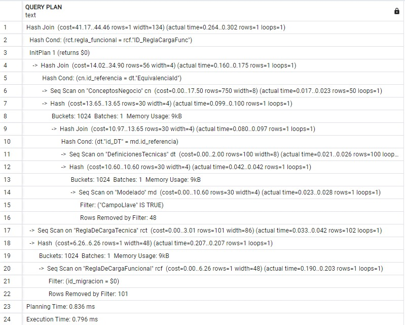
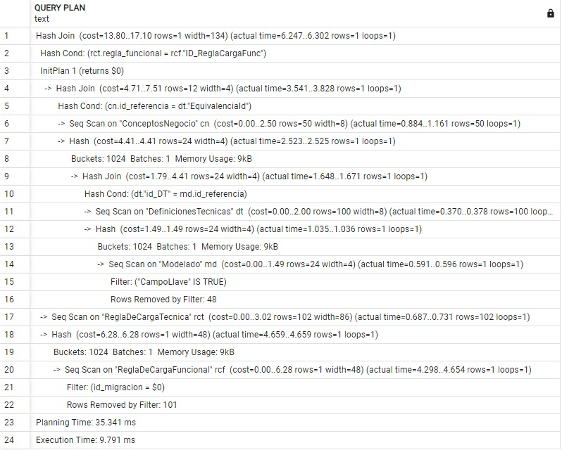
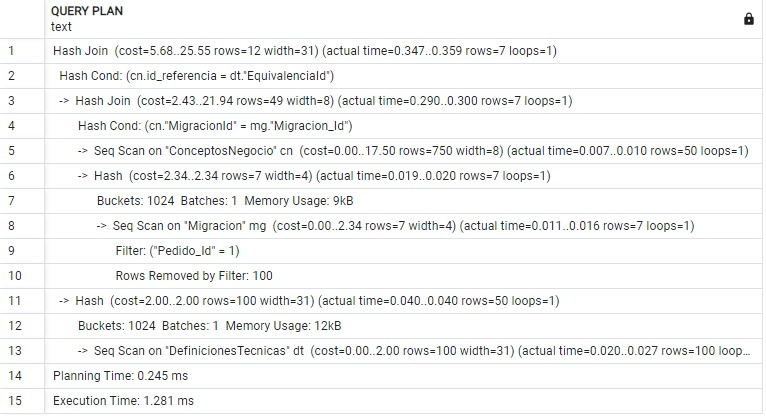
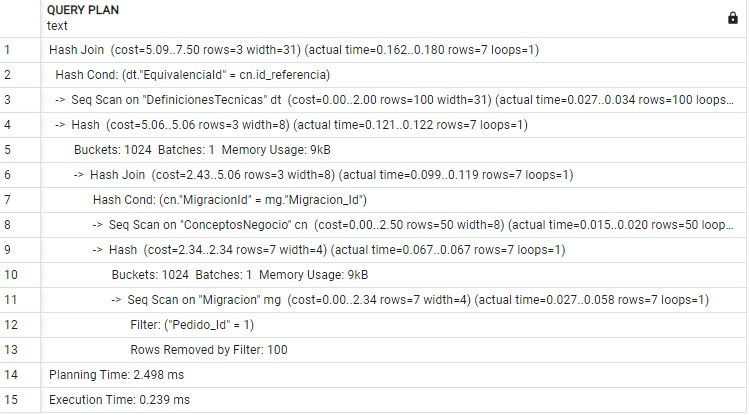

# Objectos de Base de Datos

## Gestión de Pedidos

### Vista

Se tiene una vista llamada Todo_Pedido que permite visualizar todos los atributos relacionados con la tabla Pedido. Esta vista es útil porque la consulta se utiliza frecuentemente en el módulo, tanto de forma independiente o con cláusulas WHERE adicionales. Además, facilita la escritura del código al simplificar las consultas, ya que la consulta original contiene varios JOINS.

```sql
CREATE VIEW Todo_Pedido AS
	 SELECT 
		p."Pedido_Id" AS "Pedido",
		a."Area_Nombre" AS "Área Solicitante",
		s."nombre_squad" AS "Squad Encargardo",
		e."Estado_Tipo" AS "Estado",
		pr."Prioridad_Tipo" AS "Prioridad",
		p."Pedido_Fecha" AS "Fecha del Pedido", 
		p."Pedido_FechaLimite" AS "Fecha Límite"
	FROM public."Pedido" p
	INNER JOIN public."Area" a ON a."Area_Id" = p."Area_Id"
	INNER JOIN public."Squad" s ON s.id_squad = p."Id_Squad"
	INNER JOIN public."Estado" e ON e."Estado_Id" = p."Estado_Id"
	INNER JOIN public."Prioridad" pr ON p."Prioridad_Id" = p."Prioridad_Id"
	ORDER BY p."Pedido_FechaLimite" DESC;
```

### Índice

Para optimizar el rendimiento de la consulta de la tabla Pedido basándose en un rango de fechas, se realiza un análisis del plan de ejecución con el comando EXPLAIN ANALYZE. El código es el siguiente:

```sql
EXPLAIN ANALYZE
SELECT * FROM public."Pedido"
WHERE "Pedido_FechaLimite" BETWEEN '2022-02-1' AND '2024-06-25';
```

Primero, se ejecuta la  consulta con EXPLAIN ANALYZE sin índice, lo que cual nos da lo siguiente:

<div>

</div>


Luego, de crea el siguiente el indice para Pedido_FechaLimite:

```sql
CREATE INDEX IX_P_FL ON public."Pedido"("Pedido_FechaLimite");
```

Ahora, se ejecuta la  consulta con EXPLAIN ANALYZE con el índice, lo que resulta en que:

<div>

</div>


### TRIGGER

Se crea el siguiente trigger para que se active automáticamente para actualizar la prioridad de un pedido antes de insertar un registro en la tabla Pedido. 

Primero, se crea una función que será llamada por el trigger. Esta función debe tomar los valores del registro que activó el trigger y luego actualizar los campos correspondientes. Al momento de insertar un nuevo pedido, al usuario se le pregunta si es importante. Si dice que es importante se coloca conmo prioridad alta ("Prioridad_Id" = 1) y si dice que no, se espera que la trigger complete según la diferencia fechas que hay hasta la fecha límte de la realización del pedido. 

```sql
CREATE OR REPLACE FUNCTION actualizarPrioridad() 
RETURNS TRIGGER 
LANGUAGE plpgsql
AS $$
BEGIN
    IF (NEW."Pedido_FechaLimite" - NEW."Pedido_Fecha") < 7 
	THEN
        NEW."Prioridad_Id" = 1;
    ELSIF (NEW."Pedido_FechaLimite" - NEW."Pedido_Fecha") < 15 AND NEW."Prioridad_Id" <> 1 
	THEN
        NEW."Prioridad_Id" = 2;
    ELSIF NEW."Prioridad_Id" <> 1 
	THEN
        NEW."Prioridad_Id" = 3;
    END IF;
    RETURN NEW;
END;
$$;
```

Una vez específicada la lógica en la función, se crea en trigger para que se active antes de hacer una inserción.

```sql
CREATE TRIGGER trigger_actualizarPrioridad
BEFORE INSERT ON "Pedido"
FOR EACH ROW
EXECUTE FUNCTION actualizarPrioridad();
```

## Equivalencias y Modelo

### Vista

Se tiene una vista llamada Carga_CN que permite visualizar todos los datos relacionados a la tabla Conceptos de Negocio. Se creo la vista para simplificar la escritura del codigo ya que contiene varios JOINS entre tablas.

```sql
CREATE VIEW Carga_CN AS
	SELECT 
	d."tipo_dominio" AS dominio,
	s."nombre_subdominio" AS subdominio,
	e."nombre_esquema" AS esquema,
	dt."Tabla" AS tabla,
	dt."Campo" AS campo,
	cn."DefinicionTabla",
	cn."DefinicionCampo"
	FROM public."ConceptosNegocio" cn
	INNER JOIN public."Subdominio" s ON cn."id_subdominio" = s."id_subdominio"
	INNER JOIN public."Dominio" d ON s."id_dominio" = d."id_dominio"
	INNER JOIN public."DefinicionesTecnicas" dt ON cn."id_referencia" = dt."id_DT"
	INNER JOIN public."Esquema" e ON dt."EsquemaId" = e."id_esquema";
```

### Indices

#### Indices 1
Primero se realizó un plan de ejecución para un consulta del tipo SELECT que tenpia varios joins.

```sql
EXPLAIN ANALYZE
SELECT 
d."tipo_dominio" AS dominio,
s."nombre_subdominio" AS subdominio,
e."nombre_esquema" AS esquema,
dt."Tabla" AS tabla,
dt."Campo" AS campo,
cn."DefinicionTabla",
cn."DefinicionCampo"
FROM public."ConceptosNegocio" cn
INNER JOIN public."Subdominio" s ON cn."id_subdominio" = s."id_subdominio"
INNER JOIN public."Dominio" d ON s."id_dominio" = d."id_dominio"
INNER JOIN public."DefinicionesTecnicas" dt ON cn."id_referencia" = dt."id_DT"
INNER JOIN public."Esquema" e ON dt."EsquemaId" = e."id_esquema";
```

Siendo este el resultado:
<div>

</div>

Luego se creo diferentes indices asociados a los atributos que estaban presentes en los joins.

```sql
CREATE INDEX indx_nombreSubdominio ON "Subdominio"("nombre_subdominio");

CREATE INDEX indx_tipoDominio ON "Dominio"("tipo_dominio");

CREATE INDEX indx_nombreEsquema ON "Esquema"("nombre_esquema");

CREATE INDEX indx_tablaDT ON "DefinicionesTecnicas"("Tabla");

CREATE INDEX indx_campoDt ON "DefinicionesTecnicas"("Campo");
```

Se volvió a correr el plan de ejecución de la sentencia, siendo este el resultado:

<div>

</div>

Podemos apreciar que el costo de ejecutar esta sentencia se redujo de 67.76 a 36.23 con los índices que se crearon.

#### Indices 2
Se realizó un plan de ejecución a otra setencia select de los atributos asociados a la tabla de Modelado.

```sql
EXPLAIN ANALYZE 
SELECT 
dt."Campo" AS "Campo",
m."EsquemaDDV",
m."TablaDDV",
m."CampoDDV",
m."CampoLlave",
m."Campo_Descarta"
FROM public."Modelado" m
INNER JOIN public."DefinicionesTecnicas" dt
ON m."id_referencia" = dt."id_DT"
WHERE dt."Campo" = 'CODCLAVEDESDIRESTANDARIZADO';
```

Este fue el resultado:

<div>

</div>

Luego se crearon indices de los campos asociados a esa tabla:

```sql
CREATE INDEX indx_esquemaDDV ON "Modelado"("EsquemaDDV");

CREATE INDEX indx_tablaDDV ON "Modelado"("TablaDDV");

CREATE INDEX indx_campoDDV ON "Modelado"("CampoDDV");
```

Se corrió nuevamente el plan de ejecución para el query select y el resultado fue el siguiente:

<div>

</div>

Podemos observar que el costo de ejecutar ese query se redujo de 13.03 a 3.88 despues de haber creado dichos indices.


## Definiciones De Universo, Carga y Precarga
### Indice 1

Se uso EXPLAIN ANALIZE para la siguiente consulta, sin el índice:

```sql
SELECT * 
	 FROM "ReglaDeCargaTecnica" rct INNER JOIN "ReglaDeCargaFuncional" rcf
	 ON rct."regla_funcional"=rcf."ID_ReglaCargaFunc"
	 WHERE "id_migracion"=(
	 SELECT cn."MigracionId"
		 FROM "ConceptosNegocio" cn INNER JOIN "DefinicionesTecnicas" dt
		 ON cn."id_referencia"=dt."EquivalenciaId"
		 INNER JOIN "Modelado" md ON md."id_referencia"=dt."id_DT"
		 WHERE "CampoLlave" IS true)
```
Obteniendose el siguiente resultado:
<div>

</div>
Luego se le aplicó los índices:

```sql
CREATE INDEX IDX_MODELADO ON "Modelado" ("CampoLlave");
CREATE INDEX IDX_DT ON "ConceptosNegocio" ("DefinicionTabla");
```
Tras realizar el análisis denuevo se obtuvieron los siguientes resultados:
<div>

</div>

### Indice 2

Se uso EXPLAIN ANALIZE para la siguiente consulta, sin el índice:

```sql
SELECT mg."Migracion_Id", dt."Tabla", dt."Campo"
FROM public."DefinicionesTecnicas" dt
INNER JOIN public."ConceptosNegocio" cn
    ON cn."id_referencia" = dt."EquivalenciaId"
INNER JOIN public."Migracion" mg
    ON cn."MigracionId" = mg."Migracion_Id"
WHERE mg."Pedido_Id" = 1;
```
Obteniendose el siguiente resultado:
<div>

</div>
Luego se le aplicó el siguiente índice:

```sql
CREATE INDEX IDX_DT ON "ConceptosNegocio" ("DefinicionTabla");
```
Tras realizar el análisis denuevo se obtuvieron los siguientes resultados:
<div>

</div>
[Regresar al índice](Indice.md)
